# Atomic Workflow - Technical Specification

## 0. Purpose and Scope

This document defines the implementation contract for the Atomic Workflow repository.

The core premise is:

> Clinical workflows are complex, hierarchical, and can be decomposed to near-atomic granularity.
> Once atomized and stored as structured files, they become inspectable, diffable, version-controlled, and AI-accessible — like source code for clinical operations.

The system serves three progressive layers of value:

| Layer | Purpose | Phase | Primary Users |
| ----- | ------- | ----- | ------------- |
| 1. Redesign | Decompose, restructure, and compare workflow variants | Phase 1 (MVP) | Workflow authors + clinical colleagues |
| 2. Dashboard | Visualize key parameters, variant diffs, and validation metrics | Phase 2 | Managers + QA + reviewers |
| 3. Runtime Monitor | Track live workflow execution: checklist completion, checkpoints, timing | Phase 3 (future) | Clinical teams during operations |

This spec covers Layers 1–2 in detail. Layer 3 is documented as a directional vision (§17) to ensure the data model does not preclude it.

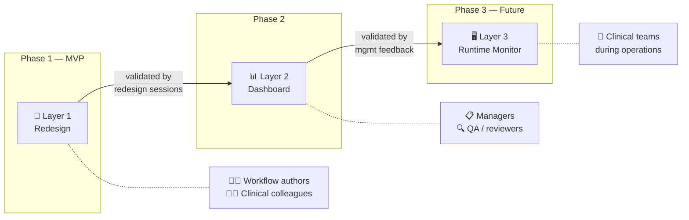

This spec is intentionally split into:

- `baseline` documents: the canonical source of workflow steps
- `variant` documents: overlay documents that describe how a variant differs from baseline
- `analysis` and archive documents: reference material, not authoritative input for parser/runtime behavior

### 0.1 Current-State Assumptions

The repository currently contains a mature markdown corpus but does not yet contain the Python core engine, MCP server, VS Code extension scaffold, or Streamlit application scaffold.
Accordingly, this document specifies the target runtime contract and the migration rules needed to reach it.

### 0.2 Implementation Priorities

Delivery is split into two phases:

#### Phase 1 — MVP (VS Code authoring workstation)

1. Parse and validate `baseline` documents
1. Normalize and parse `variant` documents as overlays
1. Implement the shared core engine API (parser, resolver, validator, graph)
1. Expose MCP tools for Copilot integration (read + structured write-back)
1. Ship the VS Code extension with tree view, interactive node editor, compare-variants, and validation
1. Enable structured write-back: VSX UI operations write changes back to `.md` files
1. Use the working VS Code toolset to conduct workflow redesign discussions with clinical colleagues

#### Phase 2 — Stakeholder dashboard (Streamlit)

1. Build Streamlit review surface importing the same core engine
1. Add dashboard metrics, graph interaction, and printable reports for management presentation
1. Add DAL enrichment (optional external data connectors)

Phase 2 starts only after Phase 1 is validated through real workflow-redesign sessions.

### 0.3 Why VS Code First

The primary workflow redesign loop is:

```text
edit markdown → validate → view graph → discuss with colleagues → iterate
```

This loop lives entirely inside VS Code. Shipping a polished VS Code experience first means:

- authors get immediate value (navigate, validate, compare variants)
- clinical colleagues can join screen-share sessions to discuss interactive workflow graphs rendered live in VS Code
- feedback from those sessions shapes the Streamlit dashboard requirements (what managers actually want to see)
- the core engine is battle-tested before a second client consumes it

### 0.4 Data Storage Philosophy: Structured Files, Not Database

The system stores workflow definitions as structured markdown files, not in a database.

This is a deliberate architectural decision:

| Concern | Structured Files | Database |
| ------- | ---------------- | -------- |
| Clinical staff maintenance | ✅ Open file, read, edit | ❌ Requires admin UI + training |
| Version control | ✅ `git diff` shows exact changes | ❌ Requires migration scripts + audit log |
| Code review | ✅ PR review on GitHub/GitLab | ❌ Requires export/diff tooling |
| AI accessibility | ✅ Copilot reads workspace files | ❌ Requires DB connector + MCP adapter |
| Scale concern | ~12 phases × ~200 steps = trivial | Overkill for this data volume |
| Future DB migration | Files → DB is straightforward (schema exists) | — |

The structured files are the **single source of truth**. They function like entity/object definitions in code:

```text
workflows/anesthesia/baseline/phase-g-induction.md
  = the serialized form of BaselinePhaseDocument for Phase G
```

All tooling (parser, validator, graph, MCP, VSX, Streamlit) reads from and writes to these files.
A database layer is not needed and not planned for MVP.

### 0.5 Deployment Topology (MVP)

MVP runs entirely on the developer/author's local machine:

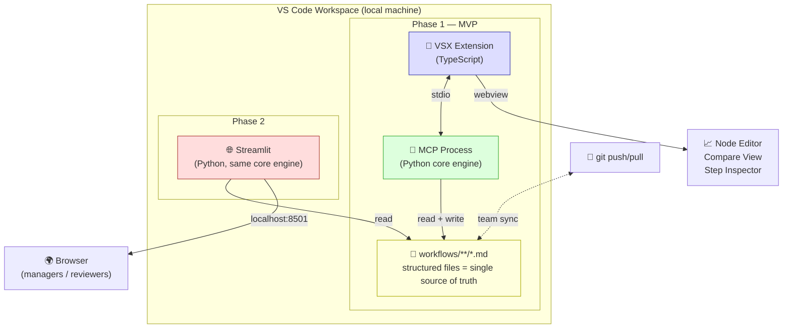

Key topology rules:

- **Phase 1**: VS Code workspace = local file server. MCP reads and writes `.md` in the same workspace.
- **Phase 2**: Streamlit runs on the same machine, reads the same workspace directory.
- **Team collaboration**: `git push/pull` synchronizes structured files. Each team member has their own local workspace.
- **Remote server**: Not required for Layers 1–2. Only Layer 3 (runtime monitor) would need shared state beyond git, and that is deferred.

### 0.6 Technology Stack

This section consolidates all technology decisions. Every library or tool used in the project **must** appear here. If code introduces a dependency not listed, it must be added to this section via PR review.

#### 0.6.1 Stack Overview

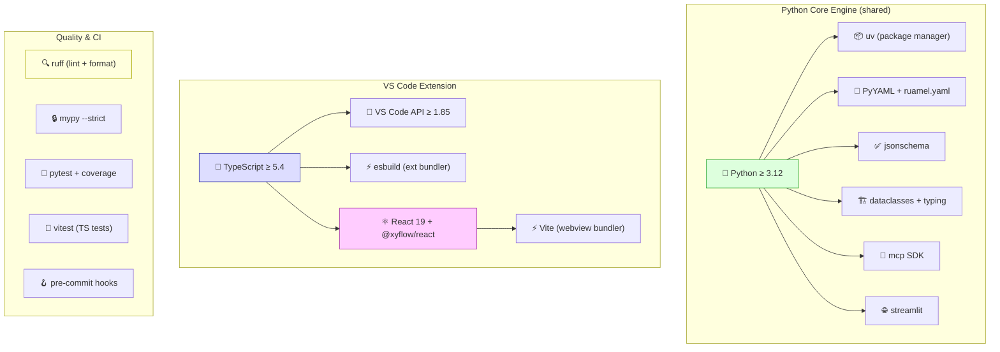

#### 0.6.2 Python Core Engine

| Category | Choice | Minimum Version | Rationale |
| -------- | ------ | --------------- | --------- |
| **Runtime** | Python | ≥ 3.12 | `type` statement, `match` stable, `StrEnum`, `tomllib` built-in |
| **Package manager** | uv | ≥ 0.5 | Fast, lockfile-based, replaces pip/poetry; `uv run`, `uv sync` |
| **Domain models** | `dataclasses` + `typing` (stdlib) | — | No external dependency; JSON serialization via `dataclasses.asdict()` |
| **YAML read** | PyYAML (`yaml.safe_load`) | ≥ 6.0 | Frontmatter parsing; `safe_load` only (no arbitrary constructors) |
| **YAML write** | ruamel.yaml (round-trip mode) | ≥ 0.18 | Preserves comments, key ordering, flow style; fallback to PyYAML if no comments |
| **JSON Schema validation** | `jsonschema` | ≥ 4.20 | Validates frontmatter against §4.2/§4.3 schemas; Draft 2020-12 support |
| **MCP server** | `mcp` SDK | ≥ 1.0 | stdio transport; tool/resource registration |
| **Streamlit** (Phase 2) | `streamlit` | ≥ 1.38 | Dashboard UI; imported after MVP validation |
| **Path handling** | `pathlib` (stdlib) | — | All file operations use `pathlib.Path`, never string concatenation |
| **Regex** | `re` (stdlib) | — | Unicode-aware by default in Python 3 |
| **Markdown parsing** | Custom regex-based (not a library) | — | §5 defines all patterns; no third-party MD parser needed |

**Explicitly excluded Python libraries:**

| Library | Reason |
| ------- | ------ |
| Pydantic | `dataclasses` sufficient; avoids heavy validation dependency |
| SQLAlchemy / any ORM | Files are the data layer (§0.4); no database |
| FastAPI / Flask | No HTTP server in MVP; MCP uses stdio |
| `python-frontmatter` | Custom frontmatter handling for tighter control (§4.4) |
| `mistune` / `markdown-it` | Custom parser (§5) — generic MD parsers can't handle the domain-specific heading semantics |

#### 0.6.3 VS Code Extension (TypeScript)

The extension is split into two build targets: **extension host** (Node.js process) and **webview UI** (browser-context React app).

##### Extension Host

| Category | Choice | Minimum Version | Rationale |
| -------- | ------ | --------------- | --------- |
| **Language** | TypeScript | ≥ 5.4 | Strict mode; VS Code extension standard |
| **VS Code API** | `@types/vscode` | engine `≥ 1.85` | TreeView, Webview, CustomEditor, Diagnostics, FileSystemWatcher APIs |
| **Bundler** | esbuild | ≥ 0.20 | Fast TypeScript bundling; recommended by VS Code extension guide |
| **Package manager** | npm | ≥ 10 | Standard for VS Code extensions; lockfile committed |
| **MCP client** | VS Code built-in MCP support | — | Extension invokes MCP tools via VS Code's language model API or spawns stdio process |
| **Extension packaging** | `@vscode/vsce` | ≥ 3.0 | Builds `.vsix` for distribution |

##### Webview UI (React App)

| Category | Choice | Minimum Version | Rationale |
| -------- | ------ | --------------- | --------- |
| **UI framework** | React | ≥ 19.0 | Mature ecosystem; used by Dify, Flowise, LangFlow for similar node-based editors |
| **Node-based editor** | `@xyflow/react` (React Flow) | ≥ 12.0 | 35k+ ⭐; drag-and-drop node editor with custom nodes, edges, minimap, controls |
| **Styling** | Tailwind CSS | ≥ 4.0 | Utility-first; fast prototyping; consistent with webview constraints |
| **Bundler** | Vite | ≥ 6.0 | Fast HMR for webview development; outputs single JS+CSS bundle for VS Code webview |
| **VS Code messaging** | `@vscode/webview-ui-toolkit` + `postMessage` | — | Type-safe bidirectional communication between extension host and webview |

The webview React app is built as a **standalone SPA** bundled into the extension's `dist/webview/` directory. The extension host loads it via `webview.html` with a CSP-compliant `<script>` tag.

**Explicitly excluded TS libraries:**

| Library | Reason |
| ------- | ------ |
| mermaid.js | Replaced by React Flow for interactive node-based editing; mermaid is read-only rendering |
| Svelte / Vue | React chosen for ecosystem compatibility with React Flow (@xyflow/react) |
| webpack | Vite (webview) + esbuild (extension host) is faster and simpler |
| Axios / node-fetch | No HTTP calls in MVP; MCP uses stdio |

#### 0.6.4 Quality Assurance

| Tool | Scope | Configuration |
| ---- | ----- | ------------- |
| **ruff** | Python lint + format | `ruff check` + `ruff format`; replaces black, isort, flake8 |
| **mypy** | Python type checking | `--strict`; per-module overrides where needed (see user memory notes) |
| **pytest** | Python tests | `pytest --cov`; unit + integration; fixtures for corpus files |
| **vitest** | TypeScript tests | Extension unit tests; mocks for VS Code API |
| **pre-commit** | Git hooks | Runs ruff, mypy, pytest (unit) on commit; full suite on push |
| **GitHub Actions** | CI | Runs on PR: lint → typecheck → test → build extension |

#### 0.6.5 Project Structure

```text
atomic-workflow/
├── workflows/                    # 📂 Source-of-truth markdown corpus
│   └── anesthesia/
│       ├── baseline/             #   phase-a-preop.md ... phase-l-postop.md
│       └── variants/             #   emergency.md, urgent.md, day-surgery.md
├── src/
│   └── atomic_workflow/          # 🐍 Python core engine (§10.3)
│       ├── domain/               #   dataclasses: BaselineStep, ResolvedStep, etc.
│       ├── parser/               #   baseline + variant parsers (§5)
│       ├── resolver/             #   variant overlay resolver (§7)
│       ├── validation/           #   ValidationReport builder (§8)
│       ├── graph/                #   graph generator (§9)
│       ├── services/             #   WorkflowService facade (§10.4)
│       ├── repository/           #   WorkflowRepository impl (§12)
│       └── mcp/                  #   MCP tool handlers (§11)
├── extension/                    # 🧩 VS Code extension (TypeScript + React)
│   ├── src/                      #   Extension host (Node.js context)
│   │   ├── extension.ts          #   activation + command registration
│   │   ├── treeView/             #   Phase Tree View provider
│   │   ├── editor/               #   WorkflowEditorProvider (CustomEditor API)
│   │   ├── diagnostics/          #   validation → VS Code Diagnostics bridge
│   │   ├── mcp/                  #   MCP client wrapper
│   │   └── messages.ts           #   postMessage type definitions (shared)
│   ├── webview-ui/               #   Webview React app (browser context)
│   │   ├── src/
│   │   │   ├── App.tsx           #   Root React component
│   │   │   ├── nodes/            #   Custom React Flow nodes
│   │   │   │   ├── StepNode.tsx
│   │   │   │   ├── PhaseNode.tsx
│   │   │   │   └── DecisionNode.tsx
│   │   │   ├── panels/           #   Inspector, Compare, Properties panels
│   │   │   ├── edges/            #   Custom edge components
│   │   │   ├── hooks/            #   useVsCodeApi, useWorkflow, etc.
│   │   │   └── stores/           #   State management (zustand or context)
│   │   ├── package.json
│   │   └── vite.config.ts
│   ├── esbuild.mjs               #   Extension host bundler config
│   ├── package.json              #   extension manifest
│   └── tsconfig.json
├── tests/
│   ├── unit/                     #   fast, no file I/O
│   ├── integration/              #   uses corpus files
│   └── fixtures/                 #   test markdown files
├── streamlit/                    # 🌐 Phase 2 dashboard (deferred)
├── schemas/                      # JSON Schema files (§4.2, §4.3)
│   ├── baseline-frontmatter.json
│   └── variant-frontmatter.json
├── scripts/
│   └── hooks/                    # Pre-commit custom hook scripts
├── memory-bank/                  # 📝 Memory Bank (跨對話記憶)
├── CONSTITUTION.md               # 專案憲法（最高原則）
├── SPEC.md                       # 技術規格契約（本文件）
├── pyproject.toml                # Python project config (uv)
├── uv.lock                      # Locked dependencies
├── .pre-commit-config.yaml
├── .editorconfig                 # 跨編輯器格式規則
├── .github/
│   ├── workflows/ci.yml          #   GitHub Actions CI
│   ├── agents/                   #   Copilot custom agents (14)
│   ├── bylaws/                   #   子法（細則規範）
│   ├── prompts/                  #   可重複使用的 prompt 檔
│   └── copilot-instructions.md   #   Copilot 自定義指令
└── README.md
```

#### 0.6.6 Completeness Verification Matrix

To **prove** the tech stack is complete, every architectural component must map to a concrete technology choice:

| Architectural Component (from spec) | Python Library / Tool | TS Library / Tool | Spec Section |
| ----------------------------------- | --------------------- | ----------------- | ------------ |
| Domain model (entities, VOs) | `dataclasses` + `typing` | — | §6 |
| Baseline parser | `re` (stdlib) | — | §5.3, §5.6 |
| Variant parser | `re` (stdlib) | — | §5.4, §5.7 |
| Resolver (overlay application) | Pure Python | — | §7 |
| Validator | Pure Python + `jsonschema` | — | §8, §4.4 |
| Graph generator | Pure Python | — | §9 |
| YAML frontmatter read | `PyYAML` | — | §4.4.1 |
| YAML frontmatter write | `ruamel.yaml` | — | §4.4.5 |
| JSON Schema validation | `jsonschema` | — | §4.2, §4.3, §4.4 |
| MCP server (transport) | `mcp` SDK (stdio) | — | §11.1 |
| MCP tool handlers | Pure Python | — | §11.2 |
| File I/O (repository) | `pathlib` (stdlib) | — | §12 |
| Snapshot / rollback | `shutil` + `tempfile` (stdlib) | — | §12.3 |
| WorkflowService facade | Pure Python (ABC) | — | §10.4 |
| VS Code tree view | — | VS Code TreeDataProvider API | §13.4 |
| VS Code webview (node editor) | — | React 19 + @xyflow/react (React Flow) | §13.4 |
| VS Code webview bundler | — | Vite | §0.6.3 |
| VS Code webview styling | — | Tailwind CSS | §0.6.3 |
| VS Code diagnostics | — | VS Code Diagnostic API | §13.4 |
| VS Code file watcher | — | VS Code FileSystemWatcher API | §13.4 |
| Extension bundling | — | esbuild | §0.6.3 |
| Streamlit dashboard (Phase 2) | `streamlit` | — | §14 |
| Lint + format | `ruff` | ESLint (standard) | §0.6.4 |
| Type checking | `mypy --strict` | TypeScript strict | §0.6.4 |
| Unit tests | `pytest` | `vitest` | §0.6.4 |
| CI pipeline | GitHub Actions | GitHub Actions | §0.6.4 |
| Package management | `uv` | `npm` | §0.6.2, §0.6.3 |

If any row has an empty cell that should be filled, the tech stack is incomplete and must be updated before implementation begins.

### 0.7 Concept Attribution — Design Influences

Atomic Workflow borrows concepts from established workflow and healthcare standards, but does **not** adopt their formats or runtime engines. This is intentional: XML-based standards are not AI-friendly, and full BPMN engines introduce execution complexity that conflicts with our "structured files, not database" philosophy (§0.4).

| Borrowed Concept | Source Standard | How We Adapt It | What We Don't Use |
| ---------------- | --------------- | --------------- | ----------------- |
| **Task / Sub-Process** | BPMN 2.0 | `node_type: task \| subprocess` in Step YAML | BPMN XML format, execution semantics |
| **Gateway (XOR / AND)** | BPMN 2.0 | `node_type: decision \| parallel_start \| parallel_end` | BPMN gateway routing rules |
| **Intermediate Event** | BPMN 2.0 | `node_type: event` + `refs[].type: triggers` | BPMN event subscription engine |
| **Sequence / Message Flow** | BPMN 2.0 | `refs[].type: sequential \| triggers \| depends_on` | BPMN Pools/Lanes XML structure |
| **Compensation** | BPMN 2.0 | `refs[].type: compensates` | BPMN compensation handlers |
| **PlanDefinition / Action** | HL7 FHIR R5 | Three-layer data model (§4.6); `refs` for action relationships | FHIR JSON/XML format, CQL expressions |
| **relatedAction.relationship** | HL7 FHIR R5 | `refs[].type` enum (triggers, depends_on, etc.) | FHIR `RequestOrchestration` engine |
| **dynamicValue** | HL7 FHIR R5 | `condition` field in Step YAML | FHIRPath evaluation engine |
| **Participant roles** | FHIR PlanDefinition | `roles` in Step YAML + `RoleAssignment` dataclass | SNOMED CT role coding (future) |
| **Decision table** | DMN 1.5 | Nested `StepItem` decision trees (text-based) | DMN XML, FEEL expression language |
| **Case adaptability** | CMMN 1.1 | Variant overlay model (baseline + variants) | CMMN XML, case lifecycle engine |
| **Workflow Patterns** | van der Aalst et al. | `refs[].type` covers 5 of 43 basic patterns | Full pattern catalogue (future) |
| **Data normalization** | SQL 1NF–4NF | Three-layer model (§4.6); `shared/` eliminates duplication | Relational database storage |

**Design principle**: We adopt the **conceptual vocabulary** of established standards (node types, relationship types, role modeling) while keeping our **data format** (Markdown + YAML) and **access pattern** (MCP tools, AI agents) unique.

**Future interoperability**: The `refs` structure and `node_type` vocabulary are designed to enable future export to FHIR PlanDefinition JSON or BPMN XML, without requiring import of those formats.

---

## 1. Source-of-Truth Model

### 1.1 Authoritative Inputs

| Path | Role | Authority Level |
| ---- | ---- | --------------- |
| `workflows/{domain}/baseline/phase-*.md` | Canonical phase workflow steps | Authoritative |
| `workflows/{domain}/variants/*.md` | Variant overlay rules and variant-only steps | Authoritative |
| `workflows/{domain}/README.md` | Human-oriented index and comparison matrix | Reference only |
| `workflows/{domain}/analysis/*.md` | Commentary and AI analysis | Reference only |
| `archive/*.md` | Historical drafts | Non-authoritative |

### 1.2 Canonical Resolution Rule

A resolved workflow for a given domain and variant is produced as:

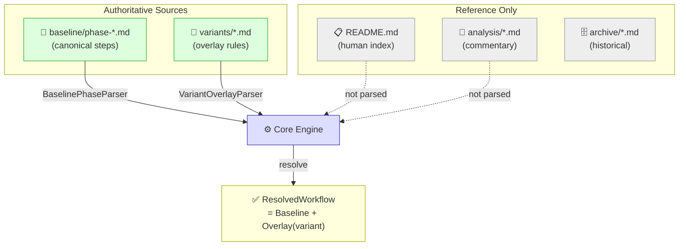

```text
ResolvedWorkflow = BaselineWorkflow + VariantOverlay(variant)
```

Where:

- baseline defines the canonical ordered step list
- variant overlay may inherit, skip, modify, replace, add, or narrate steps
- a variant must never silently redefine baseline identity rules

### 1.3 Parsing Strategy

The implementation must use two different parsers:

- `BaselinePhaseParser` for `baseline/phase-*.md`
- `VariantOverlayParser` for `variants/*.md`

A single parser contract for both file types is explicitly out of scope because the two corpora use different heading semantics.

---

## 2. Document Types

### 2.1 Baseline Phase Document

A baseline phase file represents one ordered phase of the canonical workflow.

Examples:

- `phase-a-preop.md`
- `phase-g-induction.md`

#### Required characteristics

1. One H1 phase title per file
2. Zero or more H2 section headings
3. One H3 per atomic step
4. Each step H3 begins with a single baseline step ID
5. The first non-empty line after a step heading is an executor line
6. Step content is expressed as markdown bullet lists

### 2.2 Variant Overlay Document

A variant file describes differences from baseline for one clinical variant.

Examples:

- `emergency.md`
- `urgent.md`
- `day-surgery.md`

#### Supported characteristics

A variant file may contain any of the following heading forms:

1. Single baseline step reference, such as `### [G-09] ...`
2. Step range reference, such as `### [A-01] ~ [A-14] ...`
3. Variant-only legacy step ID, such as `### [A-D01] ...`
4. Narrative headings that describe replacement behavior for a referenced range

Variant files are not required to repeat full baseline step content.
They are overlay documents, not duplicate canonical phase definitions.

### 2.3 Shared Process Document

A shared process file describes a **reusable sub-workflow** that can be triggered from multiple steps across different phases.

> **Concept attribution**: This corresponds to BPMN 2.0's "Call Activity" (a sub-process invoked from multiple places) and FHIR PlanDefinition's nested `action` groups. Unlike BPMN, shared processes are stored as standalone Markdown files with the same step structure as baseline phases.

Examples:

- `supply-restock.md` — 麻醉藥品/物資補充流程
- `difficult-airway.md` — 困難氣道處置流程
- `emergency-cart.md` — 急救車啟用流程
- `infection-control.md` — 感染控制流程

#### Directory

```text
workflows/
  anesthesia/
    baseline/         # phase files (existing)
    variants/         # overlay files (existing)
    shared/           # 🆕 shared process files
      supply-restock.md
      difficult-airway.md
      emergency-cart.md
```

#### Required characteristics

1. One H1 process title per file
2. Frontmatter with `document_type: shared_process`
3. One H3 per atomic step, using shared process step ID format: `{PROCESS_CODE}-{2-DIGIT_NUMBER}` (e.g., `SR-01`, `DA-01`)
4. Same executor line and bullet content rules as baseline steps (§2.1)
5. Frontmatter must include `triggered_by` listing the step IDs that can invoke this process

#### Shared Process Frontmatter Schema

```yaml
---
domain: anesthesia
document_type: shared_process          # 🆕 new document type
process_id: supply-restock              # unique process identifier
title: 麻醉藥品/物資補充流程
triggered_by:                           # step IDs that may trigger this process
  - G-12
  - G-15
  - I-03
  - I-22
  - J-02
primary_roles:
  - 麻醉護理師
  - 藥師
status: draft
---
```

#### Relationship to baseline and variant

- Shared processes are **not phase-specific** — they can be triggered from any phase
- Shared processes do **not** participate in variant overlay resolution; they are the same across all variants unless a variant-specific shared process override is created
- The `triggered_by` field is **informational and bidirectional** — the triggering steps must also declare a `refs` entry pointing to the shared process (§4.5.2)
- Shared processes have their own step ID namespace (e.g., `SR-01`) to avoid collision with phase step IDs

---

## 3. Identity and ID Rules

### 3.1 Baseline Step ID

Baseline step IDs use this format:

```text
{PHASE_LETTER}-{2-DIGIT_NUMBER}
```

Examples:

- `A-01`
- `E-16`
- `G-35`

Rules:

- phase letter must be `A-Z`
- sequence must be `01-99`
- baseline step IDs must be globally unique within a domain

### 3.2 Legacy Variant Step ID

The current corpus contains variant-only IDs such as:

- `A-D01`
- `B-E01`
- `G-E01`

These are valid input IDs for the current repository and must be supported by the parser.

Format:

```text
{PHASE_LETTER}-{VARIANT_CODE}{2-DIGIT_NUMBER}
```

Where:

- `VARIANT_CODE` is currently one of `D`, `E`, `U`
- `D = day-surgery`
- `E = emergency`
- `U = urgent`

Rules:

- legacy variant step IDs are unique within `(domain, variant)`
- they are not baseline step IDs
- they must never collide with baseline IDs

### 3.3 Internal Identity Model

The runtime must normalize step identity into two classes:

- `baseline_step_id`: canonical baseline identity, example `G-09`
- `variant_step_id`: variant-only identity, example `G-E01`

A resolved workflow may contain both, but all overlay operations that reference baseline content must do so by `baseline_step_id`.

---

## 4. Metadata and Frontmatter

### 4.1 Compatibility Rule

YAML frontmatter is a target-state requirement, not a current-state prerequisite.

Because the present corpus does not yet contain frontmatter, implementations must support:

- `v0 compatibility mode`: infer metadata from filename, H1, and body content when frontmatter is absent
- `v1 strict mode`: require frontmatter on all authoritative documents

### 4.2 Baseline Frontmatter Schema

When present, baseline phase files should use:

```yaml
---
domain: anesthesia
document_type: baseline_phase
phase: E
phase_name: 手術室內 - 病人安頓與監測建立
step_range: E-01 ~ E-17
step_count: 17
primary_roles:
  - 麻醉護理師
  - 麻醉醫師
  - 流動護理師
timing: 病人進入刀房 -> 監測建立完成
prev_phase: phase-d-holding.md
next_phase: phase-f-preparation.md
status: draft
---
```

#### Baseline JSON Schema

```json
{
  "type": "object",
  "required": ["domain", "document_type", "phase", "phase_name"],
  "properties": {
    "domain": {"type": "string"},
    "document_type": {"const": "baseline_phase"},
    "phase": {"type": "string", "pattern": "^[A-Z]$"},
    "phase_name": {"type": "string"},
    "step_range": {"type": "string", "pattern": "^[A-Z]-\\d{2} ~ [A-Z]-\\d{2}$"},
    "step_count": {"type": "integer", "minimum": 1},
    "primary_roles": {"type": "array", "items": {"type": "string"}},
    "timing": {"type": "string"},
    "prev_phase": {"type": ["string", "null"]},
    "next_phase": {"type": ["string", "null"]},
    "status": {"type": "string", "enum": ["draft", "reviewed", "approved"]}
  },
  "additionalProperties": false
}
```

### 4.3 Variant Frontmatter Schema

When present, variant files should use:

```yaml
---
domain: anesthesia
document_type: variant_overlay
variant: emergency
variant_code: E
title: 緊急刀流程
compared_to: elective
status: draft
---
```

#### Variant JSON Schema

```json
{
  "type": "object",
  "required": ["domain", "document_type", "variant", "variant_code"],
  "properties": {
    "domain": {"type": "string"},
    "document_type": {"const": "variant_overlay"},
    "variant": {"type": "string", "enum": ["emergency", "urgent", "day-surgery"]},
    "variant_code": {"type": "string", "enum": ["E", "U", "D"]},
    "title": {"type": "string"},
    "compared_to": {"type": "string", "enum": ["elective"]},
    "status": {"type": "string", "enum": ["draft", "reviewed", "approved"]}
  },
  "additionalProperties": false
}
```

### 4.4 YAML Frontmatter Defensive Design

Since YAML frontmatter serves as the **structured data layer** and agents (Copilot / AI) are primary operators, every read/write path must be defended against malformed, inconsistent, or destructive mutations.

#### 4.4.1 Validation Pipeline

Every frontmatter operation — whether by agent, UI, or direct file edit — must pass through this pipeline:

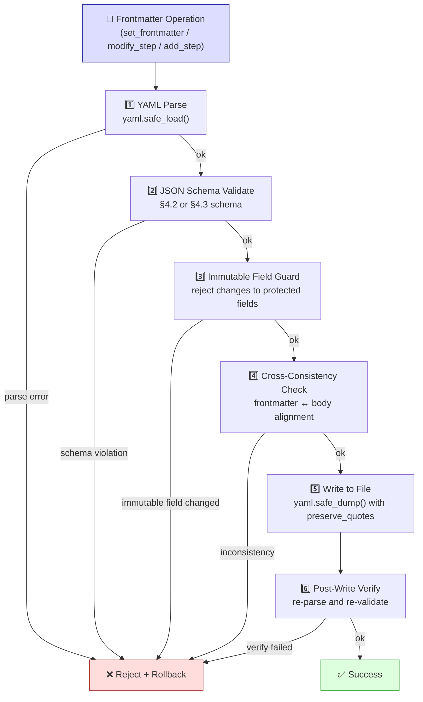

#### 4.4.2 Immutable Fields

Once a file is created, the following frontmatter fields must **never** be changed through agent or MCP operations (only through manual file edit by a human author):

| Document Type | Immutable Fields |
| ------------- | ---------------- |
| `baseline_phase` | `domain`, `document_type`, `phase` |
| `variant_overlay` | `domain`, `document_type`, `variant`, `variant_code` |

Rationale: these fields form the file's **identity**. Changing them would break all references, step IDs, and parser assumptions.

The engine must reject any `set_frontmatter` or `modify_step` call that attempts to alter an immutable field with a `FrontmatterImmutableFieldError`.

#### 4.4.3 Field-Level Merge Semantics

`set_frontmatter` must use **field-level merge**, not full replacement:

```python
# Correct: merge only specified fields
def set_frontmatter(existing: dict, updates: dict) -> dict:
    merged = {**existing, **updates}
    # reject if any immutable field differs
    for field in IMMUTABLE_FIELDS[existing['document_type']]:
        if field in updates and updates[field] != existing.get(field):
            raise FrontmatterImmutableFieldError(field)
    return merged

# WRONG: full replacement that destroys unspecified fields
def set_frontmatter_BAD(existing: dict, updates: dict) -> dict:
    return updates  # ← destroys fields not in updates
```

This prevents agents from accidentally clobbering frontmatter fields they didn't intend to change.

#### 4.4.4 Cross-Consistency Checks

After every frontmatter update, the engine must verify consistency between frontmatter metadata and document body:

| Check | Rule | Error Code |
| ----- | ---- | ---------- |
| `step_count` vs parsed steps | `frontmatter.step_count == len(parsed_steps)` | `FM_STEP_COUNT_MISMATCH` |
| `step_range` vs actual first/last | `frontmatter.step_range == f"{first_id} ~ {last_id}"` | `FM_STEP_RANGE_MISMATCH` |
| `phase` vs filename | `frontmatter.phase == phase_letter_from_filename` | `FM_PHASE_FILENAME_MISMATCH` |
| `primary_roles` vs parsed roles | `frontmatter.primary_roles ⊆ all_parsed_roles` | `FM_ROLE_MISMATCH` (warning) |
| `variant` vs filename | `frontmatter.variant == variant_from_filename` | `FM_VARIANT_FILENAME_MISMATCH` |

Severity: `step_count`, `step_range`, and `phase`/`variant` filename mismatches are **errors** (block write). Role mismatch is a **warning** (allow write, surface in validation report).

#### 4.4.5 YAML Serialization Safety

All YAML write operations must follow these rules:

1. **Use `yaml.safe_dump()`** — never `yaml.dump()` with arbitrary constructors
2. **Preserve key ordering** — use `sort_keys=False` to maintain human-readable field order
3. **UTF-8 encoding** — `allow_unicode=True` for Chinese characters
4. **No bare document markers inside body** — the frontmatter block `---` delimiters must be the only `---` at column 0 in the file header; the engine must escape or reject body content that would create ambiguous YAML boundaries
5. **Atomic file writes** — write to a temp file first, then rename (prevents corruption on crash)
6. **Preserve comments** — if the frontmatter contains YAML comments, the engine should use `ruamel.yaml` round-trip mode instead of `PyYAML`; if comments are not present, `PyYAML safe_dump` is acceptable

#### 4.4.6 Agent Operation Constraints

When an agent (Copilot) operates on frontmatter via MCP, the following constraints apply:

| Constraint | Rule |
| ---------- | ---- |
| **No full-file rewrite** | Agent must use `set_frontmatter` or `modify_step` — never raw file write to replace entire file content |
| **No frontmatter deletion** | Agent cannot remove the frontmatter block entirely; it can only update fields |
| **Batch size limit** | A single MCP call may update at most one file's frontmatter |
| **Auto-derived fields** | `step_count` and `step_range` are computed by the engine after body changes; agent must not set them manually |
| **Status transitions** | `status` field follows `draft → reviewed → approved`; agent may only advance forward, never regress |

#### 4.4.7 UI Operation Constraints

When a VS Code extension or Streamlit UI modifies frontmatter:

1. UI must use the same MCP tools (not direct file manipulation) to ensure the validation pipeline runs
2. UI may present a form-based editor that maps to `set_frontmatter` calls
3. UI must show validation errors inline before allowing save
4. UI must not expose immutable fields as editable inputs

#### 4.4.8 Error Recovery

If a frontmatter write fails at any pipeline stage:

1. **Pre-write failure** (stages 1-4): no file modification occurs; return error with detail
2. **Post-write failure** (stage 6 re-validation): restore from the pre-write backup (atomic write ensures the temp file is still available)
3. **Corrupt frontmatter detected on read**: emit `FrontmatterParseError` with the file path and raw YAML content; the engine must still attempt to parse the document body using v0 inference fallback

#### 4.4.9 Schema Evolution

When frontmatter schemas evolve (new fields, new enum values):

1. New optional fields must have `None`/missing as valid default — existing files without the field remain valid
2. New enum values (e.g., a new `variant`) must be added to the JSON Schema before any file uses them
3. The engine must report schema version in `ValidationReport` so clients know which schema was applied
4. Removed fields must go through a deprecation period: `deprecated` warning for one release cycle, then `error` in the next

### 4.5 Step-Level YAML Block

In addition to file-level frontmatter (§4.2, §4.3), each step may contain a **step-level YAML block** immediately after the H3 heading. This provides structured metadata for the step that is machine-readable, schema-validatable, and safely round-trippable via `ruamel.yaml`.

#### 4.5.1 Format

A step-level YAML block is a fenced code block with language tag `yaml`, placed immediately after the H3 step heading (before any bullet content):

```markdown
### [G-07] 面罩密合放置

```yaml
roles:
  - 麻醉醫師
equipment:
  - 面罩
  - C-E grip
warnings:
  - 有鬍鬚 → 面罩邊緣塗凡士林
duration_sec: 30
tags: [airway]
```

- 左手 C-E grip 固定面罩
- 確認密合（無漏氣）
- ⚠️ 有鬍鬚 → 面罩邊緣塗凡士林
```

#### 4.5.2 Baseline Step YAML Schema

```yaml
# All fields optional for v0 compatibility
node_type: str                 # node classification (default: "task") — see §4.5.8
roles: list[str]               # normalized role labels (§5.1)
equipment: list[str]           # items/devices required
warnings: list[str]            # ⚠️ content (without emoji prefix)
duration_sec: int | null       # estimated duration in seconds
condition: str | null          # prerequisite condition text
tags: list[str]                # searchable tags (e.g., "airway", "new")
refs: list[StepRef]            # cross-step/cross-phase references — see §4.5.9
```

#### 4.5.3 Variant Step YAML Schema

Variant steps extend the baseline schema with overlay-specific fields:

```yaml
# Overlay fields (variant only)
operation: inherit | skip | modify | replace_range | add   # required for variant steps
supersedes: str | list[str] | null    # baseline step ID(s) this replaces
added_warnings: list[str]             # warnings added by this variant
removed_warnings: list[str]           # warnings removed by this variant

# Inherited from baseline schema (all optional)
node_type: str                 # may override baseline node_type
roles: list[str]
equipment: list[str]
warnings: list[str]
duration_sec: int | null
condition: str | null
tags: list[str]
refs: list[StepRef]            # variant may add/override refs
```

#### 4.5.4 v0 Compatibility

When a step has **no YAML block**, the parser falls back to regex extraction (§5.3–§5.5):

- `roles` → extracted from `**執行者**：` line
- `warnings` → extracted from `⚠️` bullets
- `tags` → extracted from heading markers (`🆕` → `new`)
- `equipment`, `duration_sec`, `condition` → `None`

The parser must produce identical `BaselineStep` / `ResolvedStep` objects regardless of whether metadata came from YAML block or regex fallback.

#### 4.5.5 Step YAML Validation Pipeline

Step YAML blocks are validated using the same defensive pipeline as file frontmatter (§4.4.1):

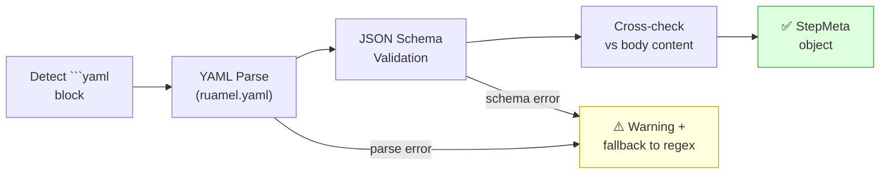

Critical rule: a malformed YAML block must **never** cause a parse failure. The parser falls back to regex extraction and emits a `STEP_YAML_PARSE_WARNING`.

#### 4.5.6 Step YAML Immutable Fields

The following fields must not be modified by MCP write tools or UI operations:

| Field | Reason |
| ----- | ------ |
| `operation` (variant) | Defines the overlay semantic; changing it requires `remove_variant_operation` + `add_variant_operation` |
| `supersedes` (variant) | Tied to the `replace_range` logic; structural change |

#### 4.5.7 Step YAML Write-Back Rules

When an MCP write tool modifies step metadata:

1. If the step already has a YAML block → update via `ruamel.yaml` roundtrip (preserving comments and ordering)
2. If the step has no YAML block → **create one** from the structured data, placed between the H3 heading and the first bullet
3. The corresponding markdown body content (e.g., `**執行者**：` line, `⚠️` bullets) must be kept in sync with the YAML block
4. YAML block is the **source of truth** when both YAML and markdown body contain the same information

#### 4.5.8 Node Type Classification

> **Concept attribution**: Node types are inspired by BPMN 2.0's element taxonomy (Task, Gateway, Event, Sub-Process) and adapted for clinical workflows. Unlike BPMN, which defines 100+ element types with complex XML schemas, Atomic Workflow uses a flat `node_type` string in Step YAML — simple enough for clinicians to write, structured enough for graph generation.

The `node_type` field classifies a step's behavior in the workflow graph. It affects visual rendering in React Flow (§13.5.2) and graph topology generation (§9).

| `node_type` | BPMN Equivalent | Description | Visual (React Flow) | Example |
| ----------- | --------------- | ----------- | ------------------- | ------- |
| `task` | Task | Standard atomic workflow step (default) | Rounded rectangle | `[G-07] 面罩密合放置` |
| `decision` | Exclusive Gateway (XOR) | Conditional branch point with multiple outcomes | Diamond (yellow) | `[G-15] 藥物劑量計算` |
| `parallel_start` | Parallel Gateway (AND fork) | Point where multiple activities begin concurrently | Thick horizontal bar (green) | `[I-01] 監測開始` |
| `parallel_end` | Parallel Gateway (AND join) | Synchronization point where concurrent activities must all complete | Thick horizontal bar (green) | `[I-20] 確認所有監測正常` |
| `subprocess` | Call Activity | Reference to a shared process (§2.3) that is invoked at this point | Double-bordered rectangle | `[G-12] → 觸發物資補充` |
| `event` | Intermediate Catch Event | External event or trigger that pauses/activates the workflow | Circle (orange) | `[D-04] 等待病房通知` |
| `milestone` | _(custom)_ | Phase boundary or significant checkpoint | Flag shape (purple) | `[F-01] 手術室準備完成` |

Default: when `node_type` is absent, the parser assumes `task`.

**Validation rule**: `node_type` must be one of the values in the table above. Unknown values produce a `STEP_INVALID_NODE_TYPE` error.

#### 4.5.9 Step References (`refs`)

> **Concept attribution**: The `refs` field is inspired by FHIR PlanDefinition's `relatedAction` element (which defines `before-start`, `before`, `after`, `after-end` relationships) and BPMN's Message Flow / Data Association patterns. Unlike FHIR, which uses FHIRPath expressions for conditions, Atomic Workflow uses natural language condition text — clinician-friendly and AI-parseable.

The `refs` field declares explicit relationships between steps, enabling the graph generator to produce non-sequential edges and the query engine to answer cross-step questions.

**YAML format**:

```yaml
refs:
  - target: "G-07"                    # step ID (same phase)
    type: depends_on
    description: "需要面罩密合評估結果"
  - target: "shared:supply-restock"   # shared process reference
    type: triggers
    condition: "藥品用完或不足時"
  - target: "A-05"                    # cross-phase reference
    type: uses_output_of
    description: "需要術前評估的體重資料"
```

**Reference type taxonomy**:

| `type` | BPMN / FHIR Equivalent | Direction | Semantics | Graph Edge |
| ------ | ---------------------- | --------- | --------- | ---------- |
| `triggers` | BPMN Message Flow / FHIR `after-start` | A ⚡→ B | A may start B | Dashed lightning arrow |
| `depends_on` | BPMN Data Association / FHIR `before-start` | A ←── B | A requires B to complete first | Dotted arrow (reverse) |
| `parallel_with` | BPMN AND Gateway / FHIR concurrent actions | A ═══ B | A and B execute concurrently | Double solid line |
| `uses_output_of` | BPMN Data Object reference | A ←·· B | A uses data produced by B | Thin dotted arrow |
| `shares_resource` | BPMN Data Store reference | A ···· B | A and B use the same equipment/resource | Grey dotted line |
| `escalates_to` | BPMN Escalation Event | A ⚠→ B | A failure triggers escalation to B | Red dashed arrow |
| `compensates` | BPMN Compensation Flow | A ↩→ B | If A fails, B executes as compensation | Orange return arrow |

**`target` format**:

| Pattern | Meaning | Example |
| ------- | ------- | ------- |
| `{step_id}` | Same-phase step reference | `"G-07"` |
| `{phase}-{step_id}` | Cross-phase step reference | `"A-05"` |
| `shared:{process_id}` | Shared process invocation (§2.3) | `"shared:supply-restock"` |
| `{domain}:{variant}:{step_id}` | Fully qualified cross-domain ref | `"surgery:elective:S-01"` |

**Validation rules**:

- `target` must resolve to an existing step ID, shared process ID, or valid `resolved_step_key` format
- `type` must be one of the 7 values in the enum above
- `condition` is optional (free-text, for human/AI consumption)
- `description` is optional (explains the relationship)
- Circular `depends_on` chains must be detected and flagged as `REF_CIRCULAR_DEPENDENCY` error
- `triggers` to a non-existent `shared:` target produces `REF_MISSING_SHARED_PROCESS` error

**Bidirectional consistency** (validated by §11.5.5 Write Hook Pipeline):

When step A declares `refs: [{target: "shared:supply-restock", type: triggers}]`, the shared process `supply-restock.md` frontmatter `triggered_by` list must include A's step ID. The validator checks this bidirectional consistency and emits `REF_BIDIRECTIONAL_MISMATCH` warning if inconsistent.

### 4.6 Three-Layer Data Model

Each workflow file follows a three-layer data architecture:

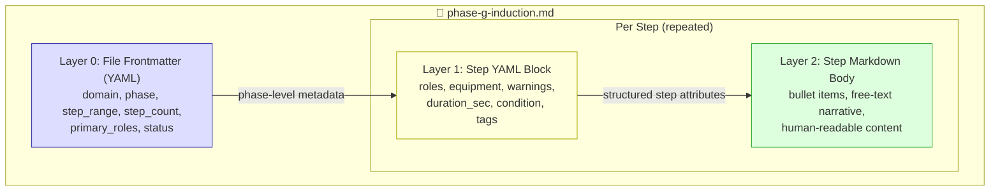

| Layer | Scope | Format | Purpose | Query Pattern |
| ----- | ----- | ------ | ------- | ------------- |
| 0 — File Frontmatter | Per phase file | YAML `---` block | Phase metadata, step count, status | `get_frontmatter()` |
| 1 — Step YAML Block | Per step | ` ```yaml ` code block | Structured step attributes | `query_step()`, `list_steps(role=...)` |
| 2 — Step Markdown Body | Per step | Bullet lists, free text | Human-readable narrative | Full-text search, display |

Design rules:

- Layer 0 is authoritative for phase-level questions ("how many steps in phase G?")
- Layer 1 is authoritative for step-level structured queries ("which steps need 麻醉醫師?")
- Layer 2 is for human consumption and full-text search; it must not contradict Layer 1
- When Layer 1 and Layer 2 conflict, Layer 1 (YAML) wins
- MCP write tools must update Layer 1 first, then sync Layer 2 body content

---

## 5. Markdown Parsing Rules

### 5.1 Role Mapping

| Emoji | Role | Code |
| ----- | ---- | ---- |
| 👨‍⚕️ | 麻醉醫師 | `ANESTHESIOLOGIST` |
| 👩‍⚕️ | 麻醉護理師 | `NURSE_ANESTHESIA` |
| 👩‍⚕️ | 流動護理師 | `NURSE_CIRCULATING` |
| 👩‍⚕️ | 病房護理師 | `NURSE_WARD` |
| 👩‍⚕️ | PACU護理師 | `NURSE_PACU` |
| 👩‍⚕️ | 等候區護理師 | `NURSE_HOLDING` |
| 👩‍⚕️ | 前台報到人員 | `NURSE_RECEPTION` |
| 🚶 | 傳送人員 | `TRANSPORTER` |

Note: `👩‍⚕️` is not sufficient by itself to determine role subtype. The parser must use the adjacent text label.

### 5.2 Shared Patterns

These patterns apply to both baseline and variant parsers:

```python
ROLE_PATTERN = r'^\*\*執行者\*\*：(.+)$'
WARNING_PATTERN = r'^\s*[-*]\s*⚠️\s*(.+)$'
```

Note: all regex operations must use Unicode-aware matching. Python 3 `re` handles this by default.

### 5.3 Baseline Heading Patterns

```python
# H1 phase title: "# Phase A：術前門診 / 照會"
BASELINE_PHASE_HEADER_PATTERN = r'^#\s+Phase\s+([A-Z])[：:]\s*(.+)$'

# H2 section grouping: "## A1. 接案 & 病歷調閱" or "## E0. 開台前準備（...）🆕"
BASELINE_SECTION_PATTERN = r'^##\s+([A-Z]\d+)\.\s+(.+?)(?:\s+🆕)?$'

# H3 atomic step: "### [A-01] 接到麻醉照會單 / 術前門診排定"
BASELINE_STEP_PATTERN = r'^###\s+\[([A-Z]-\d{2})\]\s+(.+?)(?:\s+🆕)?$'
```

### 5.4 Variant Heading Patterns

```python
# H1 variant document title: "# 🔴 E刀（Emergency）流程"
VARIANT_DOC_TITLE_PATTERN = r'^#\s+(.+)$'

# H2 variant phase section: "## Phase A：急診床邊麻醉評估（取代術前門診）"
VARIANT_PHASE_SECTION_PATTERN = r'^##\s+Phase\s+([A-Z])[：:]\s*(.+)$'

# H3 single baseline step reference: "### [A-01] 接到麻醉照會 ⚡改"
VARIANT_SINGLE_STEP_PATTERN = r'^###\s+\[([A-Z]-\d{2})\]\s+(.+)$'

# H3 step range reference: "### [A-01] ~ [A-14] 術前門診 ✅同基線"
VARIANT_RANGE_PATTERN = r'^###\s+\[([A-Z]-\d{2})\]\s+~\s+\[([A-Z]-\d{2})\]\s+(.+)$'

# H3 legacy variant-only step: "### [B-E01] ED 同步準備 🆕"
VARIANT_LEGACY_STEP_PATTERN = r'^###\s+\[([A-Z]-[DEU]\d{2})\]\s+(.+?)(?:\s+🆕)?$'
```

### 5.5 Operation Marker Extraction

After extracting the title text from a variant heading, the parser must identify the overlay operation using the trailing marker:

```python
OPERATION_MARKER_PATTERN = r'(✅同基線|⚡改動?|⏭️(?:全部)?跳過|🆕(?:新增)?)\s*$'
```

Mapping rules:

| Marker text | Normalized operation |
| ----------- | -------------------- |
| `✅同基線` | `inherit` |
| `⚡改動` or `⚡改` | `modify` |
| `⏭️跳過` or `⏭️全部跳過` | `skip` |
| `🆕` or `🆕新增` | `add` |
| *(no marker + range heading + content defines replacement)* | `replace_range` |

The corpus uses both `⚡改動` and `⚡改` — the parser must accept both forms.

### 5.6 Baseline Parsing Pipeline

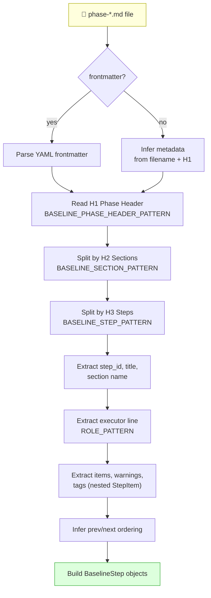

```text
Read file
-> Parse optional frontmatter
-> Read H1 phase header (BASELINE_PHASE_HEADER_PATTERN)
-> Split by H2 section headings (BASELINE_SECTION_PATTERN)
-> Split by H3 atomic step headings (BASELINE_STEP_PATTERN)
-> Extract baseline_step_id, step title, and current section name
-> Extract executor line (ROLE_PATTERN)
-> Extract items, warnings, and lightweight tags
-> Infer prev/next ordering within the phase
-> Build BaselineStep objects
```

### 5.7 Variant Parsing Pipeline

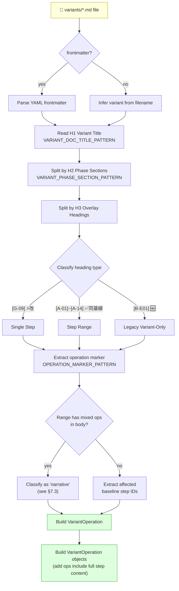

```text
Read file
-> Parse optional frontmatter
-> Read H1 variant document title (VARIANT_DOC_TITLE_PATTERN)
-> Split by H2 variant phase sections (VARIANT_PHASE_SECTION_PATTERN)
-> Split by H3 overlay headings
-> Classify heading as single-step, step-range, or legacy variant-only step
-> Extract operation marker from heading text (OPERATION_MARKER_PATTERN)
-> If range heading has mixed operations in body → classify as 'narrative' (see §7.4)
-> Extract affected baseline step ids
-> Build VariantOperation objects
-> For 'add' operations, populate variant_step_id, roles, and content_items on the VariantOperation
```

Note: there is no separate `VariantOnlyStep` dataclass. Variant-only steps are represented as `VariantOperation` objects with `operation='add'`, where the full step content (title, roles, items) is stored directly on the `VariantOperation`.

### 5.8 Executor Line Rules

For baseline steps, the executor line is required and must be the first non-empty line after the step heading.

For variant overlays:

- executor line is required only for variant-only step definitions
- executor line is optional for inherit, skip, modify, or replace declarations that primarily reference baseline content

### 5.9 Item Preservation Rule

The parser must preserve step bullet hierarchy in structured form.
A plain `list[str]` is insufficient for lossless parsing.
The runtime may additionally expose flattened text for search, but the canonical parse tree must retain nesting.

### 5.10 Tag Extraction

`BaselineStep.tags` is populated from inline markers found in the step body:

- `🆕` on the step heading → tag `new`
- other domain-specific tags may be defined per-domain in the future

For MVP, tags are optional metadata. The parser should populate `tags` as an empty list when no markers are found. Tag vocabulary is not fixed — new tags can be added without schema changes.

### 5.11 Step YAML Block Extraction

The parser must detect and extract step-level YAML blocks (§4.5) before processing bullet content.

#### 5.11.1 Detection Pattern

```python
# Detect fenced YAML block immediately after H3 heading
STEP_YAML_BLOCK_PATTERN = r'^```yaml\s*$'    # opening fence
STEP_YAML_BLOCK_END = r'^```\s*$'             # closing fence
```

#### 5.11.2 Parsing Pipeline (updated)

The baseline parsing pipeline (§5.6) is extended with a YAML block extraction step:

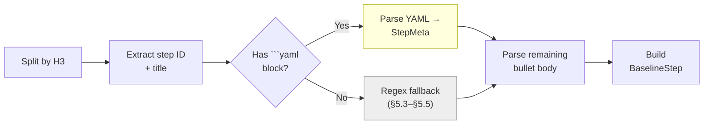

Step:

1. Split file content by H3 headings
2. For each step section, check if the first content block is a fenced ` ```yaml ` block
3. If yes: parse with `ruamel.yaml` → populate `StepMeta` → validate against schema (§4.5.5) → remaining content is bullet body
4. If no: fall back to regex extraction of `**執行者**：`, `⚠️` markers, etc. (§5.3–§5.5)
5. Build `BaselineStep` from either source (output must be identical)

#### 5.11.3 YAML-Body Sync Validation

When both YAML block and markdown body contain the same information (e.g., roles in YAML + `**執行者**：` line), the parser should:

1. Use YAML as the authoritative source
2. Emit a `STEP_YAML_BODY_MISMATCH` warning if values differ
3. Not fail — the warning is informational for the author

---

## 6. Domain Model

The following class diagram shows the relationships between domain entities:

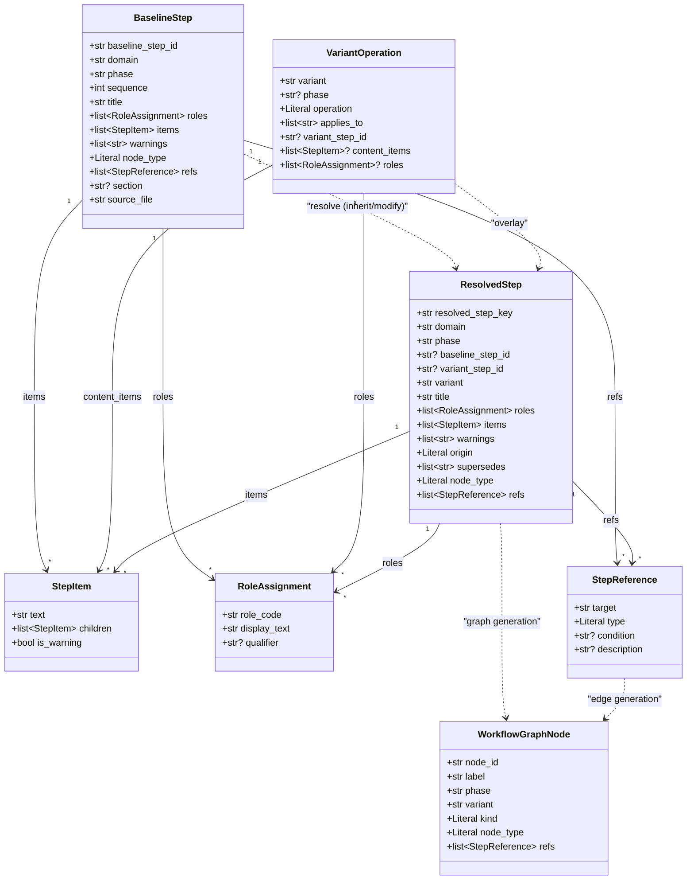

### 6.1 Baseline Step Schema

```python
@dataclass
class StepItem:
    text: str
    children: list['StepItem']
    is_warning: bool = False

@dataclass
class StepReference:
    """Explicit relationship between workflow steps (§4.5.9)."""
    target: str                    # step ID, cross-phase ref, or "shared:{process_id}"
    type: Literal[
        'triggers', 'depends_on', 'parallel_with',
        'uses_output_of', 'shares_resource',
        'escalates_to', 'compensates'
    ]
    condition: str | None = None   # free-text condition (clinician-friendly)
    description: str | None = None # explains the relationship

@dataclass
class BaselineStep:
    baseline_step_id: str
    domain: str
    phase: str
    sequence: int
    title: str
    roles: list['RoleAssignment']
    items: list[StepItem]
    warnings: list[str]
    tags: list[str]
    node_type: Literal[
        'task', 'decision', 'parallel_start', 'parallel_end',
        'subprocess', 'event', 'milestone'
    ]
    refs: list[StepReference]
    section: str | None
    source_file: str
    source_variant: str = 'elective'
    prev_step_id: str | None = None
    next_step_id: str | None = None
```

### 6.2 Role Assignment Schema

```python
@dataclass
class RoleAssignment:
    role_code: str
    display_text: str
    qualifier: str | None = None
```

### 6.3 Variant Operation Schema

```python
@dataclass
class VariantOperation:
    variant: str
    phase: str | None
    operation: Literal['inherit', 'skip', 'modify', 'replace_range', 'add', 'narrative']
    applies_to: list[str]
    variant_step_id: str | None = None
    title: str | None = None
    rationale: str | None = None
    content_items: list[StepItem] | None = None
    roles: list[RoleAssignment] | None = None
    source_file: str | None = None
```

### 6.4 Resolved Step Schema

```python
@dataclass
class ResolvedStep:
    resolved_step_key: str
    domain: str
    phase: str
    baseline_step_id: str | None
    variant_step_id: str | None
    variant: str
    title: str
    roles: list[RoleAssignment]
    items: list[StepItem]
    warnings: list[str]
    origin: Literal['baseline', 'modified', 'variant_only', 'replacement']
    supersedes: list[str]
    node_type: Literal[
        'task', 'decision', 'parallel_start', 'parallel_end',
        'subprocess', 'event', 'milestone'
    ] = 'task'
    refs: list[StepReference] = field(default_factory=list)
```

#### `resolved_step_key` Construction

The key must be globally unique within a resolved workflow:

```text
{domain}:{variant}:{step_id}
```

Where `step_id` is `baseline_step_id` if present, otherwise `variant_step_id`.

Examples:

- `anesthesia:elective:A-01`
- `anesthesia:emergency:G-E01`
- `anesthesia:day-surgery:K-D01`

### 6.5 Why `WorkflowNode` Was Expanded

The previous `WorkflowNode` shape was too shallow for the current corpus because the markdown includes:

- nested bullet structure
- multi-role execution lines
- replacement behavior across ranges
- conditional and variant-only steps

A flatter, simplified DTO may still be exposed by MCP for convenience, but the parser must build the richer model first.

---

## 7. Variant Semantics

### 7.1 Supported Overlay Operations

The following diagram shows the resolver flow — how baseline steps and variant operations combine into a resolved workflow:

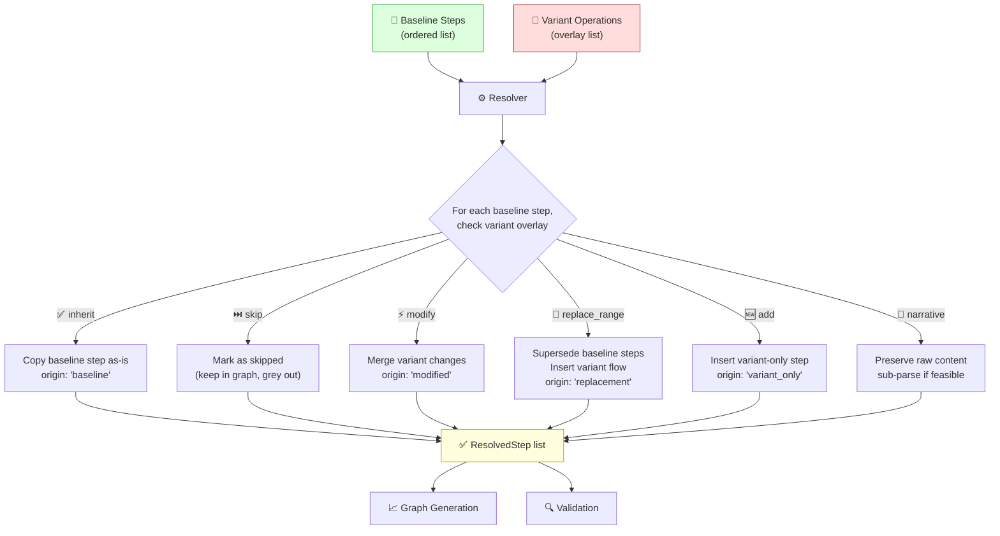

A variant overlay entry must normalize into one of the following operations:

1. `inherit`
   - Meaning: same as baseline
   - Corpus markers: `✅同基線`

2. `skip`
   - Meaning: baseline step exists but is not executed in this variant
   - Corpus markers: `⏭️跳過`, `⏭️全部跳過`

3. `modify`
   - Meaning: baseline step exists and remains identifiable, but content differs
   - Corpus markers: `⚡改動`, `⚡改` (both forms appear in the current corpus)

4. `replace_range`
   - Meaning: one or more baseline steps are superseded by a variant-specific flow
   - Example: `G-E01` replacing `G-11 ~ G-19`
   - No explicit emoji marker; identified by a legacy variant step ID that references a baseline range

5. `add`
   - Meaning: a variant-only step is inserted without deleting referenced baseline identity
   - Corpus markers: `🆕`, `🆕新增`
   - Example: `A-D01`

6. `narrative`
   - Meaning: a range heading whose body contains mixed operations for different sub-ranges
   - The parser must preserve the raw content; the resolver may sub-parse to extract per-step operations when feasible
   - See §7.4 for details

### 7.2 Step Range Interpretation

A range heading such as:

```text
### [A-01] ~ [A-14] 術前門診 ✅同基線
```

must be normalized to the ordered list of baseline step IDs in that inclusive range.

Range validity rules:

- both endpoints must exist in baseline for the same phase
- endpoints must be ordered correctly
- no cross-phase ranges are allowed

### 7.3 Mixed-Operation Range Headings

The corpus contains range headings whose body text applies different operations to different sub-ranges within the same heading. For example, in `emergency.md`:

```text
### [G-11] ~ [G-34] 其他誨導/RA/MAC 步驟
- GA 插管：由 [G-E01] RSI 流程取代標準 G-11 ~ G-19    ← replace_range
- G-20 以後（插管後）：✅同基線                      ← inherit
- RA（G-31 ~ G-33）：極少使用 → 跳過              ← skip
- MAC（G-34）：極少使用                         ← skip
```

Rules for handling `narrative` ranges:

- The parser must classify the heading-level operation as `narrative`
- The `VariantOperation.content_items` must preserve the full raw text
- The resolver may attempt per-step sub-parsing (inferring `inherit`, `skip`, `replace_range` for individual steps) but must not fail if the body is not machine-parseable
- In `v1 strict mode`, narrative headings should be refactored into explicit per-step or per-sub-range headings

### 7.4 Legacy Variant Step Placement

For current-corpus compatibility, variant-only steps may omit explicit insertion metadata.
When insertion location is not explicit, the resolver must infer placement using the surrounding section and nearest referenced baseline steps.

This behavior is allowed in `v0 compatibility mode` but should become explicit metadata in `v1 strict mode`.

### 7.5 Range-Then-Override Pattern

The corpus contains cases where a range heading declares an operation, and a subsequent heading overrides one specific step within that range. For example, in `emergency.md`:

```text
### [J-01] ~ [J-03] ✅同基線          ← range: inherit all
### [J-02] 調整麻醉深度 ⚡改          ← override: modify J-02
```

Precedence rule: **the more specific heading wins**. When a single-step heading follows a range heading that covers the same step, the single-step operation takes priority over the range operation for that step.

The resolver must:

- expand the range into individual step operations
- apply subsequent single-step overrides on top
- the final resolved operation for `J-02` is `modify`, not `inherit`

### 7.6 Headings Without Standard Markers (Narrative Fallback)

The corpus contains range headings that use natural language instead of standard emoji markers. For example:

```text
### [J-08] ~ [J-09] 同基線（如拔管）/ 如帶管 → 跳過
### [K-05] ~ [K-09] ICU 接手後由 ICU 團隊管理 / PACU 同基線
```

When the `OPERATION_MARKER_PATTERN` fails to match, the parser must:

- classify the heading as `narrative`
- preserve the full heading text and body content in `VariantOperation.content_items`
- the resolver may attempt heuristic sub-parsing (e.g., detecting `同基線` or `跳過` keywords in the text) but must not fail if the text cannot be normalized

In `v1 strict mode`, these headings should be refactored into explicit per-step entries with standard markers.

---

## 8. Validation Specification

### 8.1 Validation Goals

`validate_workflow` must verify both syntactic validity and semantic consistency.

### 8.2 Validation Report Schema

```python
@dataclass
class ValidationIssue:
    severity: Literal['error', 'warning', 'info']
    code: str
    message: str
    file: str
    line: int | None = None
    step_id: str | None = None

@dataclass
class ValidationReport:
    domain: str
    valid: bool
    errors: list[ValidationIssue]
    warnings: list[ValidationIssue]
    infos: list[ValidationIssue]
    stats: dict[str, int]
```

### 8.3 Required Baseline Checks

The validator must check (suggested `code` values in parentheses):

- filename matches `phase-{letter}-{short-name}.md` (`BL_FILENAME`)
- H1 phase letter matches filename phase letter (`BL_H1_MISMATCH`)
- every baseline H3 heading contains one valid baseline step ID (`BL_INVALID_STEP_ID`)
- baseline step IDs are unique within the domain (`BL_DUPLICATE_ID`)
- step ordering is strictly increasing within a phase (`BL_ORDER`)
- `step_range`, if present, matches the first and last parsed baseline step ID (`BL_RANGE_MISMATCH`)
- `step_count`, if present, matches parsed step count (`BL_COUNT_MISMATCH`)
- required executor line exists after every baseline step heading (`BL_MISSING_EXECUTOR`)
- all role labels can be normalized to a known role code (`BL_UNKNOWN_ROLE`)

### 8.4 Required Variant Checks

The validator must check (suggested `code` values in parentheses):

- each variant file name maps to a known variant key (`VAR_UNKNOWN_FILE`)
- each referenced baseline step ID exists (`VAR_MISSING_STEP_REF`)
- each referenced range is valid and phase-local (`VAR_INVALID_RANGE`)
- each legacy variant step ID matches the current legacy pattern (`VAR_BAD_LEGACY_ID`)
- `replace_range` operations declare at least one superseded baseline step (`VAR_EMPTY_REPLACE`)
- conflicting operations on the same baseline step are surfaced (`VAR_CONFLICT`)

### 8.5 Compatibility Warnings

The validator should emit warnings, not hard errors, for:

- missing frontmatter in `v0 compatibility mode`
- missing explicit insertion metadata for variant-only steps
- narrative sections that cannot be normalized losslessly but can still be preserved as raw text

---

## 9. Graph Specification

### 9.1 Graph Types

The system must support two graph views:

- `baseline graph`: only canonical elective workflow
- `resolved variant graph`: baseline plus selected variant overlay

### 9.2 Graph Node Schema

```python
@dataclass
class WorkflowGraphNode:
    node_id: str
    label: str
    phase: str
    variant: str
    kind: Literal['baseline', 'variant_only', 'replacement', 'skipped', 'narrative']
    node_type: Literal[
        'task', 'decision', 'parallel_start', 'parallel_end',
        'subprocess', 'event', 'milestone'
    ] = 'task'
    refs: list['StepReference'] = field(default_factory=list)
```

### 9.3 Graph Edge Schema

```python
@dataclass
class WorkflowGraphEdge:
    source: str
    target: str
    edge_type: Literal[
        'sequential',
        'variant_replace', 'variant_insert_after',
        'triggers', 'depends_on', 'parallel_with',
        'uses_output_of', 'shares_resource',
        'escalates_to', 'compensates'
    ]
    condition: str | None = None    # free-text from StepReference.condition
    description: str | None = None  # from StepReference.description
```

### 9.4 Skip and Replace Handling in Graphs

The following diagram illustrates how skip and replace operations affect graph structure:

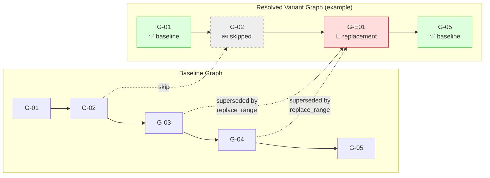

When generating a resolved variant graph:

- `skip` nodes: must be **included** in the graph with a `kind: 'skipped'` marker. Presentation clients may render them as greyed-out or collapsed, but the node must exist so that graph structure is complete. Edges to and from skipped nodes use `edge_type: 'sequential'`.
- `replace_range` nodes: the superseded baseline nodes are **omitted** from the graph. The replacement node (or variant-only nodes) takes their position. A `variant_replace` edge connects the replacement node to the next non-superseded node.
- `add` nodes: variant-only steps are inserted into the graph at their resolved position. They connect to their predecessor and successor using `edge_type: 'variant_insert_after'`.
- `narrative` ranges: preserved as a single composite node with `kind: 'narrative'` until sub-parsing produces finer resolution. Connected with `edge_type: 'sequential'`.

### 9.5 Minimum Graph Guarantees

`get_phase_graph` must at minimum return sequential order.

When `refs` fields are present on resolved steps, the graph generator must additionally:

1. Create non-sequential edges based on `StepReference.type` → `WorkflowGraphEdge.edge_type` mapping (see §4.5.9 reference type taxonomy)
2. Set `WorkflowGraphNode.node_type` from the step's `node_type` field (default: `task`)
3. Validate that all `refs.target` values resolve to existing nodes; unresolved targets produce a `GRAPH_UNRESOLVED_REF` warning
4. Detect circular `depends_on` chains and emit `GRAPH_CIRCULAR_DEPENDENCY` error

The graph generator must produce a valid directed graph (not necessarily acyclic — `compensates` edges may create cycles). Clients are responsible for layout algorithms that handle non-tree topologies.

### 9.6 Shared Process Subgraph Expansion

When a step has `node_type: subprocess` and a `refs` entry with `type: triggers` targeting a `shared:{process_id}`, the graph generator must:

1. Create a `subprocess` node for the triggering step
2. Optionally inline the shared process steps as a collapsible subgraph (controlled by `expand_subprocesses: bool` parameter on `get_phase_graph`)
3. When collapsed: render as a single double-bordered node
4. When expanded: render shared process steps as nested nodes with internal sequential edges

---

## 10. Core Engine and Client Architecture

### 10.1 Architectural Principle

The system must follow a single-core, multi-client architecture:

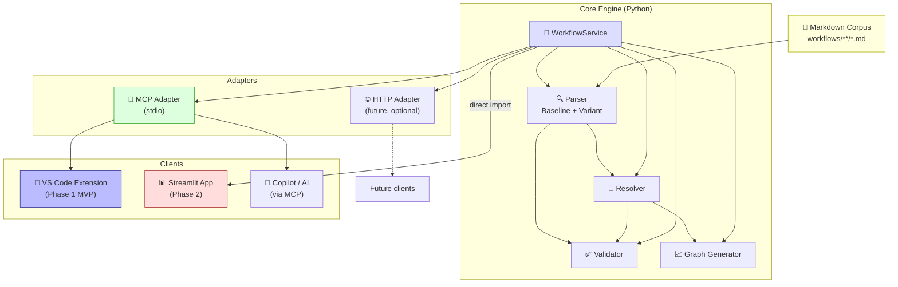

Rules:

- workflow parsing, resolution, validation, and graph generation belong to the core engine
- no presentation client may reimplement parsing or variant resolution rules independently
- all clients must consume the same resolved-step and graph contracts

### 10.2 Core Engine Responsibilities

The core engine owns:

- markdown parsing
- baseline and variant normalization
- resolved workflow generation
- validation
- graph generation
- search and filter semantics
- shared DTO serialization

### 10.3 Suggested Python Package Boundaries

```text
src/atomic_workflow/
  domain/
  parser/
  resolver/
  validation/
  graph/
  services/
  repository/
  mcp/
```

The VS Code extension lives in `extension/` (TypeScript, separate build). The Streamlit app lives in `streamlit/` (Phase 2). See §0.6.5 for the full project structure.

The exact folder layout may change, but the logical separation must remain.

### 10.4 Core Service Interfaces

```python
class WorkflowService(ABC):
  # --- Read methods ---
  @abstractmethod
  def get_baseline_step(self, domain: str, step_id: str) -> BaselineStep: ...

  @abstractmethod
  def get_resolved_step(self, domain: str, step_id: str, variant: str = 'elective') -> ResolvedStep: ...

  @abstractmethod
  def list_steps(self, domain: str, variant: str = 'elective', **filters) -> list[ResolvedStep]: ...

  @abstractmethod
  def compare_variants(self, domain: str, phase: str, variants: list[str]) -> 'VariantComparison': ...

  @abstractmethod
  def validate(self, domain: str, mode: str = 'compat') -> ValidationReport: ...

  @abstractmethod
  def build_phase_graph(self, domain: str, phase: str, variant: str = 'elective') -> dict: ...

  @abstractmethod
  def get_frontmatter(self, domain: str, file: str) -> dict | None: ...

  # --- Write methods — Step CRUD (Phase 1b) ---
  @abstractmethod
  def add_step(self, domain: str, phase: str, after_step_id: str, title: str,
               roles: list[RoleAssignment], items: list[StepItem]) -> 'WriteResult': ...

  @abstractmethod
  def modify_step(self, domain: str, step_id: str, variant: str | None = None,
                  changes: dict | None = None) -> 'WriteResult': ...

  @abstractmethod
  def delete_step(self, domain: str, step_id: str,
                  variant: str | None = None) -> 'WriteResult': ...

  @abstractmethod
  def move_step(self, domain: str, step_id: str, target_phase: str,
                after_step_id: str) -> 'WriteResult': ...

  @abstractmethod
  def reorder_steps(self, domain: str, phase: str, new_order: list[str]) -> 'WriteResult': ...

  # --- Write methods — Frontmatter (Phase 1b) ---
  @abstractmethod
  def set_frontmatter(self, domain: str, file: str, metadata: dict) -> 'WriteResult': ...

  # --- Write methods — Variant Lifecycle (Phase 1b) ---
  @abstractmethod
  def create_variant(self, domain: str, variant: str, variant_code: str,
                     title: str, compared_to: str = 'elective') -> 'WriteResult': ...

  @abstractmethod
  def delete_variant(self, domain: str, variant: str) -> 'WriteResult': ...

  @abstractmethod
  def add_variant_operation(self, domain: str, variant: str, phase: str,
                            step_id_or_range: str, operation: str,
                            content: dict | None = None) -> 'WriteResult': ...

  @abstractmethod
  def remove_variant_operation(self, domain: str, variant: str, phase: str,
                               step_id_or_range: str) -> 'WriteResult': ...

  # --- Write methods — File Lifecycle (Phase 2) ---
  @abstractmethod
  def create_phase(self, domain: str, phase_letter: str, phase_name: str,
                   prev_phase: str | None = None, next_phase: str | None = None) -> 'WriteResult': ...

  @abstractmethod
  def rename_phase(self, domain: str, phase_letter: str,
                   new_phase_name: str) -> 'WriteResult': ...

  @abstractmethod
  def create_domain(self, domain: str) -> 'WriteResult': ...

  # --- Batch / Dry-run ---
  @abstractmethod
  def batch_modify(self, domain: str,
                   operations: list[dict]) -> 'WriteResult': ...

  @abstractmethod
  def dry_run(self, domain: str, tool: str, params: dict) -> dict: ...
```

`WorkflowService` is the **facade** consumed by MCP adapters and clients. Implementations delegate to `WorkflowRepository` (§12) for data access and to the parser/resolver/validator/graph modules for logic. All write methods return a `WriteResult` (§11.5.2) that includes previous state for undo capability.

### 10.5 Client Consumption Rules

Client access should follow these rules:

- VS Code and Copilot flows consume the core engine through MCP-facing adapters
- Streamlit should import the core engine directly in-process, not depend on stdio MCP as its primary integration layer
- any future remote or browser-first client may use an HTTP adapter, but HTTP is not required for MVP

### 10.6 Shared Serialization Contract

The core engine must expose stable JSON-serializable DTOs for:

- `BaselineStep`
- `ResolvedStep`
- `VariantOperation`
- `ValidationReport`
- `WriteResult` (§11.5.2)
- graph nodes and graph edges

This contract is the interoperability boundary between core logic and presentation clients.

### 10.7 Runtime Topology

The architecture must distinguish between:

- core logic
- adapters
- user-facing clients
- long-running server processes

Important clarification:

- the VS Code client is not a standalone backend server
- its execution backend is the VS Code extension host process managed by VS Code itself
- MCP is an integration adapter, not the same thing as the VS Code client
- Streamlit is a web application process and does run as a server

### 10.8 MVP Process Model (Phase 1)

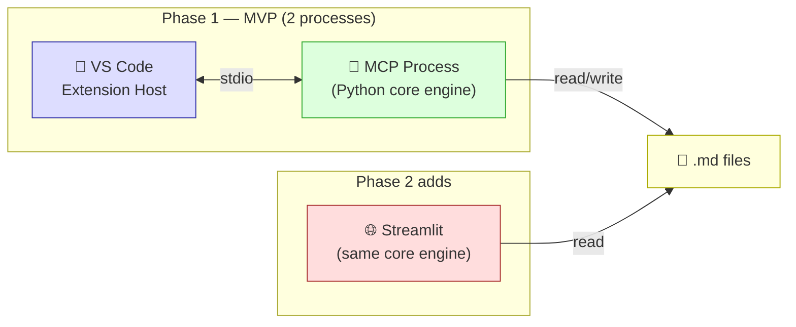

The Phase 1 MVP requires only two processes:

1. `VS Code extension host`

- managed by VS Code
- runs the VS Code client logic (tree view, React Flow node editor webview, diagnostics)
- not separately deployed by this project

1. `Python MCP process`

- started on demand when MCP-backed workflow tools are needed
- wraps the shared core engine
- used primarily for Copilot and VS Code tool integration

Phase 2 adds:

1. `Streamlit process`

- started only when the review dashboard is needed for stakeholder presentation
- imports the shared core engine directly
- serves the browser UI for managers and reviewers

In other words, the MVP does not require three separately designed backend stacks.
It requires one shared Python core, one optional MCP adapter process, and one optional Streamlit app process.

### 10.9 Why a Separate VS Code Server Is Not Required

For MVP, the VS Code client should use one of these patterns:

- consume workflow data through MCP-backed commands and adapters
- or call a lightweight local Python entry point backed by the same core engine

The project should not introduce a separate always-on `vsx server` unless later requirements justify it.

### 10.10 Future Deployment Modes

The architecture should support these deployment modes:

1. `Authoring mode`

- VS Code extension host active
- MCP process available on demand
- Streamlit off unless explicitly launched

1. `Review mode`

- Streamlit active
- MCP optional
- VS Code not required for viewers

1. `Shared-service mode` (future, optional)

- a local or intranet HTTP API may be introduced if multiple clients must share one long-running backend
- both VS Code and Streamlit may then consume the same API

This future HTTP service is optional and not part of MVP.

### 10.11 Process Boundary Rules

Rules:

- parsing and resolver logic must not be duplicated across processes
- MCP must remain a thin adapter over the shared core engine
- Streamlit must not reimplement parser or graph logic internally
- VS Code client features that do not need a long-running Python process may remain in the extension host
- if a future HTTP API is added, it must wrap the same core engine rather than replace it

---

## 11. MCP Server Specification

### 11.1 Transport

The following sequence diagram shows the interaction flow between clients, MCP, core engine, and files:

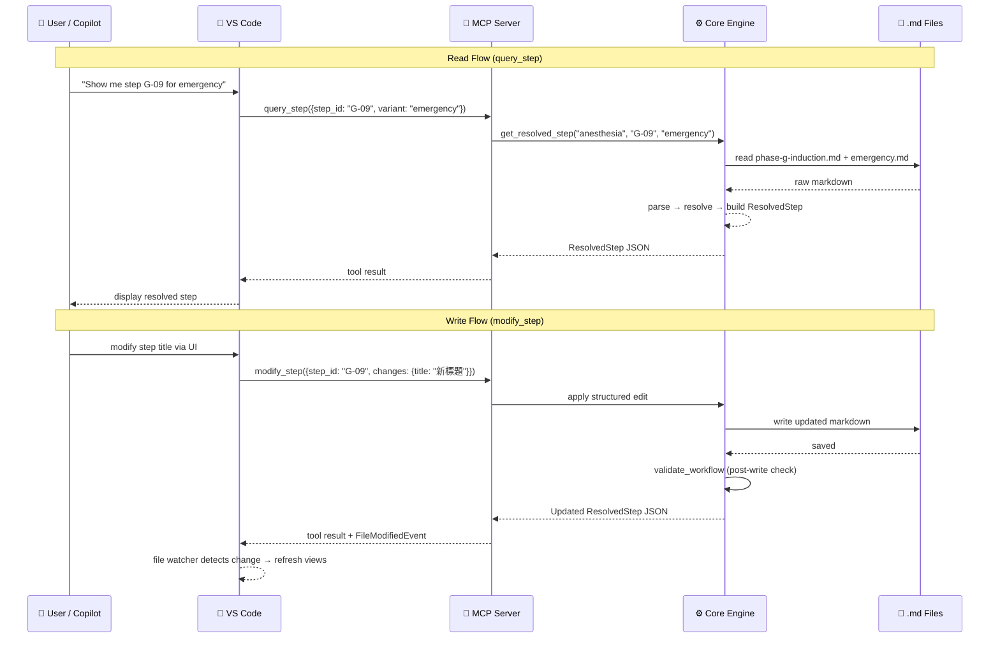

- Protocol: MCP (Model Context Protocol)
- Transport: stdio
- Recommended implementation: Python with the `mcp` SDK

### 11.2 Tool Summary

#### Read Tools

| Tool | Input | Output | Notes |
| ---- | ----- | ------ | ----- |
| `query_step` | `{domain: str, step_id: str, variant?: str}` | `ResolvedStep` or `BaselineStep` JSON | Supports baseline and legacy variant IDs; `domain` defaults to first available |
| `list_steps` | `{domain: str, phase?: str, role?: str, variant?: str, tag?: str}` | `ResolvedStep[]` JSON | `variant` defaults to `elective` |
| `get_phase_graph` | `{domain: str, phase: str, variant?: str, format: "reactflow" or "json"}` | React Flow-compatible JSON (nodes + edges) or raw graph JSON | `variant` optional; `reactflow` format includes layout positions |
| `compare_variants` | `{domain: str, phase: str, variants: str[]}` | Variant comparison JSON and markdown summary | Must be based on normalized overlay ops |
| `validate_workflow` | `{domain: str, mode?: "compat" or "strict"}` | `ValidationReport` JSON | Defaults to `compat` |
| `enrich_step` | `{domain: str, step_id: str, variant?: str, source: str}` | Enriched JSON | Read-only external data lookup |

#### Write Tools — Step CRUD (Phase 1b)

| Tool | Input | Output | Notes |
| ---- | ----- | ------ | ----- |
| `add_step` | `{domain, phase, after_step_id, title, roles, items}` | Updated step ID + file path | Inserts new step, renumbers subsequent IDs |
| `modify_step` | `{domain, step_id, variant?, changes: {title?, roles?, items?}}` | Updated `ResolvedStep` JSON | Structured field-level update only |
| `delete_step` | `{domain, step_id, variant?}` | Deletion confirmation + renumbered IDs | Removes step and renumbers; `variant` set → removes override only |
| `move_step` | `{domain, step_id, target_phase, after_step_id}` | Updated step ID + old/new file paths | Moves step across phases; renumbers both source and target |
| `reorder_steps` | `{domain, phase, new_order: str[]}` | Updated step list | Reorders and renumbers within a phase |

#### Write Tools — Frontmatter CRUD (Phase 1b)

| Tool | Input | Output | Notes |
| ---- | ----- | ------ | ----- |
| `set_frontmatter` | `{domain, file, metadata: dict}` | Updated frontmatter | Field-level merge (§4.4.3); validates via §4.4.1 pipeline |
| `get_frontmatter` | `{domain, file}` | Current frontmatter JSON | Read-only; returns parsed+validated frontmatter |

#### Write Tools — Variant Lifecycle (Phase 1b)

| Tool | Input | Output | Notes |
| ---- | ----- | ------ | ----- |
| `create_variant` | `{domain, variant, variant_code, title, compared_to?}` | New variant file path + frontmatter | Creates variant overlay file with frontmatter; validates `variant_code` uniqueness |
| `delete_variant` | `{domain, variant}` | Deletion confirmation | Deletes variant overlay file; requires `--confirm` flag |
| `add_variant_operation` | `{domain, variant, phase, step_id_or_range, operation, content?}` | Updated variant file | Adds a new overlay operation entry to the variant file |
| `remove_variant_operation` | `{domain, variant, phase, step_id_or_range}` | Updated variant file | Removes an overlay operation from the variant file |

#### Write Tools — File Lifecycle (Phase 2)

| Tool | Input | Output | Notes |
| ---- | ----- | ------ | ----- |
| `create_phase` | `{domain, phase_letter, phase_name, prev_phase?, next_phase?}` | New phase file path + frontmatter | Creates empty baseline phase file with valid frontmatter |
| `rename_phase` | `{domain, phase_letter, new_phase_name}` | Updated frontmatter | Updates `phase_name` in frontmatter only; does not change phase letter |
| `create_domain` | `{domain}` | New domain directory path | Creates `workflows/{domain}/baseline/` and `workflows/{domain}/variants/` directories |

#### Batch Tools (Phase 1b)

| Tool | Input | Output | Notes |
| ---- | ----- | ------ | ----- |
| `batch_modify` | `{domain, operations: [{tool, params}]}` | Array of individual results | Executes multiple write operations atomically; all-or-nothing |
| `dry_run` | `{domain, tool, params}` | Simulated result + diff preview | Runs any write tool without committing; returns what would change |

#### Write Tool Safety Model

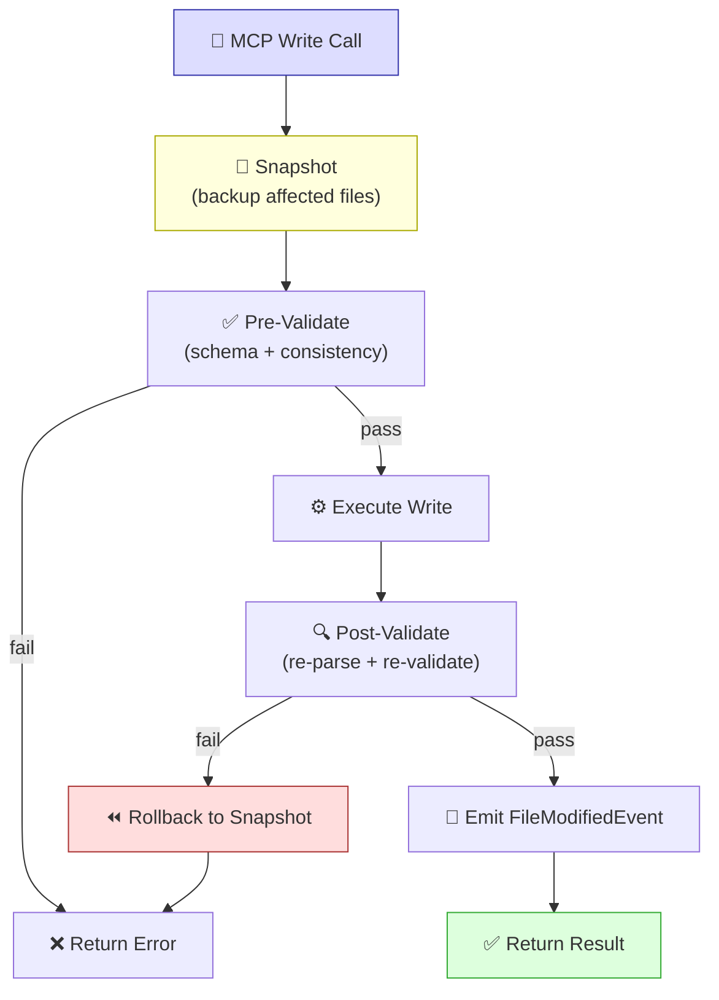

Write tool constraints:

- all write operations produce valid markdown that round-trips through the parser
- write operations must not corrupt content outside the targeted step or frontmatter block
- after every write, the modified file must pass `validate_workflow` without new errors
- write operations emit a `FileModifiedEvent` that the VSX file watcher can detect
- `modify_step` with `variant` omitted → edits the **baseline** file directly
- `modify_step` with `variant` set → edits the **variant overlay** file (creates or updates the override entry for that step)
- `delete_step` and `delete_variant` require explicit confirmation (`confirm: true`) to prevent accidental data loss
- `batch_modify` executes atomically: if any operation fails validation, none are applied
- `dry_run` never modifies files; it returns a JSON diff preview of the proposed changes
- all write tools snapshot affected files before modification; snapshot is used for rollback on post-validation failure

### 11.3 Query Semantics

`query_step` rules:

- if `step_id` is a baseline step ID and `variant` is omitted, return canonical baseline step
- if `step_id` is a baseline step ID and `variant` is set, return resolved step for that variant
- if `step_id` is a legacy variant step ID, resolve within its owning variant

### 11.4 Error Handling

Minimum error contract:

- unknown baseline step -> `StepNotFoundError`
- unknown variant step -> `VariantStepNotFoundError`
- unknown phase -> `PhaseNotFoundError`
- malformed range -> `InvalidRangeError`
- overlay conflict -> `VariantConflictError`
- DAL failure -> `ExternalDataUnavailableError`
- YAML parse failure -> `FrontmatterParseError`
- YAML schema violation -> `FrontmatterValidationError`
- immutable field change attempt -> `FrontmatterImmutableFieldError`
- frontmatter ↔ body mismatch -> `FrontmatterInconsistencyError`
- write post-validation failure -> `WriteRollbackError`
- confirmation required but not provided -> `ConfirmationRequiredError`
- batch operation partial failure -> `BatchOperationError`

Errors should include:

- machine-readable code
- human-readable message
- likely file or step reference when known
- suggestion text when a fuzzy match is available
- for write errors: the pre-write snapshot state so the caller can understand what was rolled back

### 11.5 Agent Safety Guardrails

Since agents (Copilot / AI) are primary consumers of the MCP server, the system must enforce guardrails that prevent well-intentioned but destructive agent behavior.

#### 11.5.1 Destructive Operation Protection

| Tool | Risk Level | Confirmation Required | Undo Mechanism |
| ---- | ---------- | --------------------- | -------------- |
| `add_step` | Low | No | `delete_step` |
| `modify_step` | Low | No | Re-`modify_step` with original values (returned in response) |
| `delete_step` | **High** | `confirm: true` required | Snapshot restore |
| `move_step` | Medium | No | `move_step` back (original IDs returned in response) |
| `reorder_steps` | Medium | No | `reorder_steps` with original order (returned in response) |
| `set_frontmatter` | Low | No | Previous frontmatter returned in response |
| `create_variant` | Low | No | `delete_variant` |
| `delete_variant` | **High** | `confirm: true` required | Snapshot restore |
| `add_variant_operation` | Low | No | `remove_variant_operation` |
| `remove_variant_operation` | Medium | No | `add_variant_operation` with original content (returned) |
| `batch_modify` | **High** | `confirm: true` required | Atomic rollback |

#### 11.5.2 Response Envelope

Every write tool must return a response envelope that enables undo:

```python
@dataclass
class WriteResult:
    success: bool
    tool: str                          # which tool was called
    affected_files: list[str]          # files modified
    previous_state: dict | None        # state before modification (for undo)
    current_state: dict                # state after modification
    validation_report: ValidationReport # post-write validation
    warnings: list[str]                # non-blocking issues
```

#### 11.5.3 Rate Limiting and Scope Constraints

- An agent session may perform at most **50 write operations** before the engine emits a `WriteLimitWarning` (not a hard block; the warning signals the agent to pause and confirm with the user)
- A single `batch_modify` call may contain at most **20 operations**
- Write operations are scoped to a single `domain` per call — cross-domain mutations require separate calls
- The engine logs every write operation with timestamp, tool name, parameters, and caller identity for audit trail

#### 11.5.4 Dry Run Convention

Every write tool supports a `dry_run: true` parameter that:

1. Runs the full validation pipeline (§4.4.1)
2. Computes the diff between current and proposed state
3. Returns the diff as a JSON patch (RFC 6902 format)
4. **Does not modify any file**

Agents should use `dry_run` before destructive operations to preview changes. The VS Code extension must present the dry-run diff to the user before committing.

#### 11.5.5 Write Hook Pipeline (Strict Enforcement)

Every MCP write operation must pass through a **strict hook pipeline** before and after file modification. Hooks are non-bypassable — there is no `--no-verify` equivalent for MCP tools.

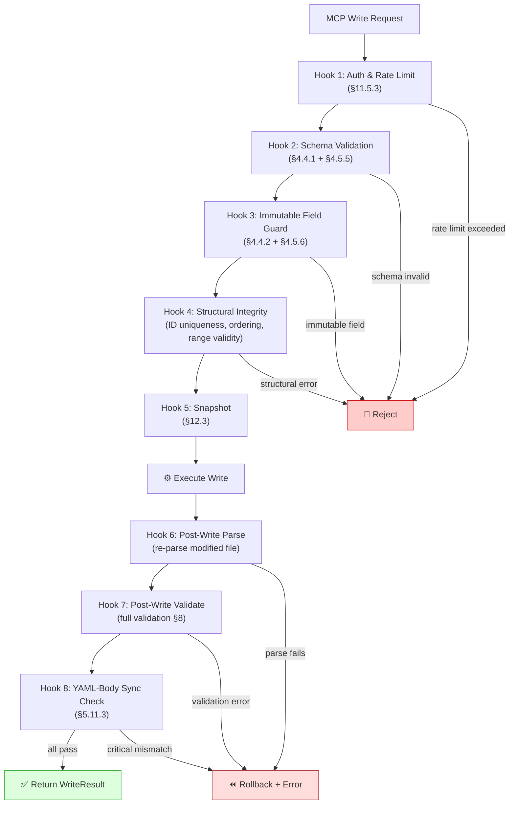

**Pre-write hooks** (any failure → request rejected, no file touched):

| Hook | Check | Error Code | Blocks |
| ---- | ----- | ---------- | ------ |
| Auth & Rate Limit | Session write count < 50; batch size < 20 | `WRITE_LIMIT_EXCEEDED` | All writes |
| Schema Validation | Step YAML + frontmatter conform to JSON Schema | `SCHEMA_INVALID` | All writes |
| Immutable Field Guard | `domain`, `document_type`, `phase`, `variant`, `variant_code`, `operation`, `supersedes` not modified | `IMMUTABLE_FIELD` | `modify_step`, `set_frontmatter` |
| Structural Integrity | Step ID unique, ordering valid, range references valid, phase letter matches file | `STRUCTURAL_ERROR` | `add_step`, `move_step`, `reorder_steps` |

**Post-write hooks** (any failure → rollback to snapshot):

| Hook | Check | Error Code | Action on Fail |
| ---- | ----- | ---------- | -------------- |
| Post-Write Parse | Modified file can be fully re-parsed without error | `POST_PARSE_FAILED` | Rollback |
| Post-Write Validate | Full validation (§8) passes or only has warnings (no new errors) | `POST_VALIDATE_FAILED` | Rollback |
| YAML-Body Sync | Step YAML block and markdown body are consistent (§5.11.3) | `YAML_BODY_DESYNC` | Warning (not rollback, unless critical) |

#### 11.5.6 Hook Audit Trail

Every hook execution is logged with:

```python
@dataclass
class HookLogEntry:
    timestamp: str              # ISO 8601
    tool: str                   # MCP tool name
    hook: str                   # hook name (e.g., "schema_validation")
    passed: bool
    error_code: str | None
    details: str | None         # human-readable context
    caller: str                 # agent identity or "vscode-extension"
```

The audit trail is stored in `.atomic-workflow/audit.jsonl` (append-only, one JSON object per line). This enables post-hoc analysis of agent behavior and debugging of write failures.

---

## 12. DAL Specification

### 12.1 Repository Interfaces

```python
from abc import ABC, abstractmethod

class WorkflowRepository(ABC):
    # --- Read ---
    @abstractmethod
    def get_baseline_step(self, domain: str, step_id: str) -> BaselineStep: ...

    @abstractmethod
    def get_resolved_step(self, domain: str, step_id: str, variant: str) -> ResolvedStep: ...

    @abstractmethod
    def list_steps(self, domain: str, variant: str, **filters) -> list[ResolvedStep]: ...

    @abstractmethod
    def get_phase_graph(self, domain: str, phase: str, variant: str) -> dict: ...

    @abstractmethod
    def get_frontmatter(self, domain: str, file: str) -> dict | None: ...

    @abstractmethod
    def list_variants(self, domain: str) -> list[str]: ...

    @abstractmethod
    def list_phases(self, domain: str) -> list[str]: ...

    # --- Write ---
    @abstractmethod
    def add_step(self, domain: str, phase: str, after_step_id: str,
                 title: str, roles: list, items: list) -> str: ...

    @abstractmethod
    def modify_step(self, domain: str, step_id: str, variant: str | None,
                    changes: dict) -> None: ...

    @abstractmethod
    def delete_step(self, domain: str, step_id: str, variant: str | None) -> None: ...

    @abstractmethod
    def move_step(self, domain: str, step_id: str, target_phase: str,
                  after_step_id: str) -> str: ...

    @abstractmethod
    def reorder_steps(self, domain: str, phase: str,
                      new_order: list[str]) -> list[str]: ...

    @abstractmethod
    def set_frontmatter(self, domain: str, file: str, metadata: dict) -> dict: ...

    # --- File Lifecycle ---
    @abstractmethod
    def create_phase_file(self, domain: str, phase_letter: str,
                          phase_name: str, frontmatter: dict) -> str: ...

    @abstractmethod
    def create_variant_file(self, domain: str, variant: str,
                            variant_code: str, frontmatter: dict) -> str: ...

    @abstractmethod
    def delete_variant_file(self, domain: str, variant: str) -> None: ...

    # --- Snapshot / Rollback ---
    @abstractmethod
    def snapshot(self, files: list[str]) -> str: ...

    @abstractmethod
    def rollback(self, snapshot_id: str) -> None: ...


class ExternalDataConnector(ABC):
    name: str

    @abstractmethod
    async def enrich(self, step: ResolvedStep) -> dict: ...

    @abstractmethod
    async def health_check(self) -> bool: ...

    @abstractmethod
    def get_capabilities(self) -> list[str]: ...
```

### 12.2 DAL Boundary Rule

External connectors may enrich step context, but they must not redefine canonical workflow structure.
Workflow structure remains owned by the markdown repository.

### 12.3 Snapshot Implementation

The snapshot/rollback mechanism for write safety (§11.2 Write Tool Safety Model) must:

1. Copy affected file(s) to a temporary directory before any write operation
2. Return a `snapshot_id` that uniquely identifies the backup set
3. On `rollback(snapshot_id)`, restore all files from the backup atomically
4. Clean up old snapshots after successful post-validation (keep only the most recent N snapshots, configurable, default 10)
5. Snapshot storage must be outside the workflow directory to avoid git noise (e.g., `.atomic-workflow/snapshots/`)

### 12.4 Step Index

The repository must maintain an **in-memory step index** for O(1) step lookup. The index is not persisted to disk — no `.json` index files to avoid git noise.

#### 12.4.1 Index Structure

```python
@dataclass
class StepLocation:
    file_path: str                          # e.g., "workflows/anesthesia/baseline/phase-g-induction.md"
    line_number: int                        # H3 heading line number (1-based)
    yaml_block_range: tuple[int, int] | None  # (start, end) line numbers of YAML block, or None
    body_range: tuple[int, int]             # (start, end) line numbers of markdown body

class StepIndex:
    """In-memory index, built lazily, invalidated by FileSystemWatcher."""

    # Baseline: step_id → StepLocation
    _baseline_index: dict[str, StepLocation]

    # Variant: (variant_name, step_id) → StepLocation
    _variant_index: dict[tuple[str, str], StepLocation]

    # Phase file tracking: phase_letter → file_path
    _phase_files: dict[str, str]

    # Tracks which files have been indexed
    _indexed_files: set[str]
```

#### 12.4.2 Lookup Strategy

Step ID naming convention (§3) enables O(1) file location without full-corpus scanning:

```
query_step("G-07")
  → step_id[0] = "G"                           # O(1) — phase letter extraction
  → _phase_files["G"] = "phase-g-induction.md"  # O(1) — phase file lookup
  → parse file if not in _indexed_files          # lazy — only on first access
  → _baseline_index["G-07"] → StepLocation      # O(1) — dict lookup
```

For `list_steps()` with filters:

```
list_steps(domain="anesthesia", role="麻醉醫師")
  → iterate _baseline_index.values()            # filter by step YAML roles field
  → lazy-parse any files not yet indexed
```

#### 12.4.3 Cache Invalidation

The index must be invalidated when source files change:

1. **FileSystemWatcher** (VS Code extension context): watches `workflows/**/*.md` → on change, clears index entries for the modified file
2. **Post-write hook** (MCP write context): after any write tool modifies a file, the affected file's index entries are cleared and re-built on next access
3. **Manual refresh**: `WorkflowRepository.invalidate_cache(file_path?)` clears specific file or entire index

The index is **never stale** during a write operation because the post-write hook pipeline (§11.5.5) forces re-parse after every write.

#### 12.4.4 Performance Expectations

| Operation | Cold (first access) | Warm (cached) |
| --------- | ------------------- | ------------- |
| `query_step("G-07")` | ~50ms (parse 1 file) | < 1ms |
| `list_steps(phase="G")` | ~50ms (parse 1 file) | < 1ms |
| `list_steps()` (all steps) | ~200ms (parse 12 files) | < 5ms |
| `list_steps(role="麻醉醫師")` | ~200ms (parse all + filter) | < 5ms |

---

## 13. VS Code Client Specification (MVP Core)

### 13.1 Role

The VS Code client is the **MVP delivery target** — an interactive workflow authoring workstation where clinical workflows are visualized, edited, and discussed using a **node-based editor** embedded in VS Code webview panels.

The core redesign loop:

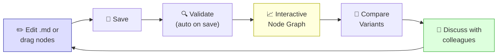

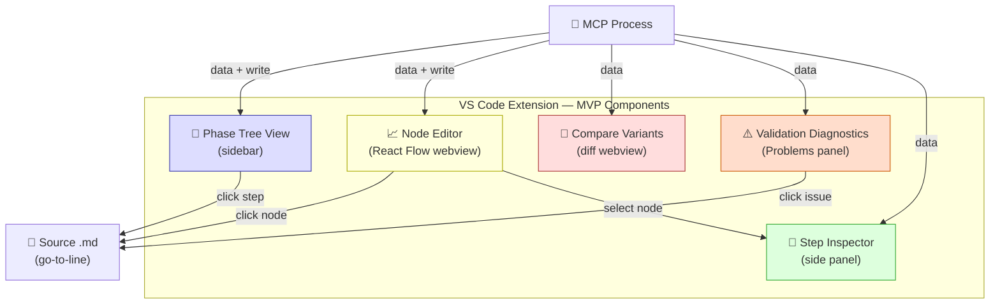

Primary users:

- workflow authors (editing via node editor + markdown)
- clinical colleagues (screen-sharing during workflow redesign discussions)
- developers (building and debugging the core engine)
- Copilot users (querying steps and variants via MCP)

Primary goals:

- **interactive node-based workflow editing** — drag nodes, connect edges, edit properties inline
- navigate source markdown with structured tree and go-to-step
- inspect resolved steps in-context with source-linked deep navigation
- visualize phase flowcharts as interactive React Flow graphs in webview panels
- compare variants side-by-side while editing source files
- run validation and surface issues as VS Code diagnostics
- **bidirectional sync**: visual edits → update `.md` files; `.md` edits → update graph

### 13.2 Architecture

The extension follows a **dual-process architecture**:

```mermaid
graph TB
    subgraph "Extension Host (Node.js)"
        EXT["extension.ts"]
        TREE["TreeDataProvider"]
        EDITOR["WorkflowEditorProvider\n(CustomEditorProvider)"]
        DIAG["Diagnostics Bridge"]
        MCPC["MCP Client\n(stdio)"]
        MSG["postMessage\nRouter"]
    end

    subgraph "Webview (browser context)"
        REACT["React 19 App"]
        RF["@xyflow/react\n(React Flow 12)"]
        NODES["Custom Nodes\nStepNode / PhaseNode\nDecisionNode"]
        PANELS["Inspector Panel\nCompare Panel\nProperties Panel"]
        STORE["State Store\n(zustand)"]
    end

    subgraph "Python Core Engine"
        MCP_SRV["MCP Server\n(stdio)"]
        ENGINE["Parser → Resolver\n→ Validator → Graph"]
        FILES["📂 Markdown Files"]
    end

    EXT --> TREE
    EXT --> EDITOR
    EXT --> DIAG
    EXT --> MCPC
    EDITOR --> MSG
    MSG <-->|"postMessage API"| REACT
    REACT --> RF
    RF --> NODES
    REACT --> PANELS
    REACT --> STORE
    MCPC <-->|"stdio"| MCP_SRV
    MCP_SRV --> ENGINE
    ENGINE --> FILES

    style RF fill:#fcf,stroke:#a3a
    style REACT fill:#ddf,stroke:#33a
    style MCP_SRV fill:#ffd,stroke:#aa0
```

#### 13.2.1 Communication Protocol

Extension host ↔ Webview communication uses `postMessage` with typed message envelopes:

```typescript
// Shared message types (extension/src/messages.ts)
type ExtToWebview =
  | { type: 'graph:update'; payload: ReactFlowGraph }
  | { type: 'step:select'; payload: { stepId: string } }
  | { type: 'variant:changed'; payload: { variant: string } }
  | { type: 'validation:results'; payload: ValidationIssue[] }
  | { type: 'theme:changed'; payload: { isDark: boolean } };

type WebviewToExt =
  | { type: 'node:clicked'; payload: { stepId: string } }
  | { type: 'node:moved'; payload: { stepId: string; position: { x: number; y: number } } }
  | { type: 'node:edited'; payload: { stepId: string; changes: StepChanges } }
  | { type: 'edge:created'; payload: { source: string; target: string } }
  | { type: 'variant:select'; payload: { variant: string } }
  | { type: 'command:execute'; payload: { command: string; args: unknown[] } };
```

#### 13.2.2 Data Flow

1. **Load**: Extension host calls MCP `get_phase_graph` → receives graph JSON → sends `graph:update` to webview
2. **User interaction**: User drags/clicks in React Flow → webview sends typed message to extension host
3. **Write-back**: Extension host calls MCP write tools (`modify_step`, `move_step`, etc.) → engine updates `.md` → file watcher triggers reload
4. **Auto-refresh**: `FileSystemWatcher` detects `.md` save → re-fetch graph via MCP → send `graph:update` to webview

### 13.3 Activation

```json
{
  "activationEvents": [
    "workspaceContains:**/workflows/**/phase-*.md",
    "workspaceContains:**/workflows/**/variants/*.md",
    "onView:atomicWorkflow.phaseTree",
    "onCommand:atomicWorkflow.openEditor"
  ]
}
```

### 13.4 Commands

| Command | Title | MVP | Notes |
| ------- | ----- | --- | ----- |
| `atomicWorkflow.openEditor` | Open Workflow Editor | ✅ | Opens React Flow node editor for selected phase |
| `atomicWorkflow.compareVariants` | Compare Variants for Phase | ✅ | Side-by-side diff for redesign discussions |
| `atomicWorkflow.validateDomain` | Validate Workflow Domain | ✅ | Diagnostics panel with file deep-links |
| `atomicWorkflow.refreshTree` | Refresh Phase Tree | ✅ | Sidebar tree re-sync after markdown edits |
| `atomicWorkflow.goToStep` | Go to Step by ID | ✅ | Quick navigation from step ID |
| `atomicWorkflow.openDashboard` | Open Workflow Dashboard | Phase 2 | Lightweight metrics panel; full dashboard in Streamlit |

### 13.5 MVP UI Components

The MVP extension must ship five components across two contexts:

#### 13.5.1 Phase Tree View (sidebar — Extension Host)

- hierarchical: domain → phase → steps
- clicking a step opens source markdown at the exact heading line
- variant selector at tree-view top changes the resolved step list
- context menu: "Open in Editor", "Go to Source", "Inspect Step"
- badges show step count per phase, warning count per step

#### 13.5.2 Workflow Node Editor (webview panel — React Flow)

This is the **primary visual artifact** for workflow redesign discussions.

**Architecture**: A React 19 app powered by `@xyflow/react` (React Flow 12), bundled with Vite, loaded into a VS Code webview panel.

**Node types** (custom React Flow nodes):

| Node Type | Visual | Represents | Color |
| --------- | ------ | ---------- | ----- |
| `StepNode` | Rounded rectangle with icon | A single workflow step (`node_type: task`) | Blue (baseline), Red (variant_only), Orange (modified), Grey (skipped) |
| `PhaseNode` | Collapsible group | A phase container | Light blue background |
| `DecisionNode` | Diamond shape | Conditional branch point (`node_type: decision`) | Yellow |
| `ParallelNode` | Thick horizontal bar | Fork/join synchronization (`node_type: parallel_start` or `parallel_end`) | Green |
| `SubprocessNode` | Double-bordered rectangle | Shared process invocation (`node_type: subprocess`) | Purple border |
| `EventNode` | Circle with icon | External event or trigger (`node_type: event`) | Orange |
| `MilestoneNode` | Flag / pentagon shape | Phase boundary checkpoint (`node_type: milestone`) | Purple |
| `NarrativeNode` | Dashed rectangle | Narrative/composite range | Light grey |

**Edge types** (custom React Flow edges):

| Edge Type | Visual | Represents |
| --------- | ------ | ---------- |
| `sequential` | Solid arrow | Normal flow |
| `variant_replace` | Dashed red arrow | Replacement flow |
| `variant_insert_after` | Dotted green arrow | Insertion point |
| `triggers` | Dashed lightning arrow (⚡) | A may start B (subprocess invocation, event trigger) |
| `depends_on` | Dotted reverse arrow | A requires B to complete first |
| `parallel_with` | Double solid line | A and B execute concurrently |
| `uses_output_of` | Thin dotted arrow | A uses data produced by B |
| `shares_resource` | Grey dotted line | A and B share equipment/resource |
| `escalates_to` | Red dashed arrow (⚠) | Failure escalation path |
| `compensates` | Orange return arrow (↩) | Compensation/rollback flow |

**Node interaction behaviors**:

| Interaction | Behavior |
| ----------- | -------- |
| Click node | Select node → show details in Inspector panel |
| Double-click node | Navigate to source `.md` file at the step heading line |
| Drag node | Reposition for visual layout (positions saved per-session) |
| Right-click node | Context menu: Edit, Delete, Add After, Go to Source |
| Hover node | Tooltip with step ID, roles, and kind |

**Canvas features**:

- Pan and zoom with mouse/trackpad
- Minimap (React Flow built-in) showing full graph overview
- Controls panel (zoom in/out, fit view, lock interaction)
- Background grid (React Flow built-in)
- Auto-layout: dagre or elkjs for initial node positioning
- Color coding by `kind` to instantly distinguish baseline / modified / variant_only / skipped steps

**Auto-refresh**: When the underlying `.md` file is saved, the extension host's `FileSystemWatcher` re-fetches the graph via MCP and sends a `graph:update` message. React Flow reconciles new graph data while preserving user's viewport position.

**Bidirectional editing (Phase 1b)**:

- Editing node properties in the Inspector → calls MCP `modify_step` → updates `.md`
- Adding a node via toolbar → calls MCP `add_step` → inserts into `.md`
- Deleting a node via context menu → calls MCP `delete_step` → removes from `.md`
- Reordering via drag (future) → calls MCP `reorder_steps` → updates `.md`

#### 13.5.3 Compare Variants (webview panel — React)

- select two or more variants for a phase
- renders two React Flow graphs side-by-side with synchronized pan/zoom
- nodes are color-coded by overlay operation (inherit / skip / modify / replace_range / add)
- highlights differences in roles, items, and warnings
- clicking a differing node shows a structured diff in the Inspector

#### 13.5.4 Validation Diagnostics (Extension Host)

- runs `validate_workflow` and maps issues to VS Code Diagnostic objects
- errors and warnings appear in the Problems panel with file + line links
- triggered on save or via command
- validation issues are also surfaced as node badges in the React Flow graph (red dot for error, yellow for warning)

#### 13.5.5 Step Inspector (webview side panel — React)

- displays resolved step detail when a node is selected in the editor
- shows: step ID, title, roles, items (bullet content), warnings, origin, supersedes
- editable fields (Phase 1b): title, roles, items — edits call MCP write tools
- accessible from tree view click or node editor node selection
- collapsible sections for each field group

### 13.6 React Flow Graph Contract

The MCP `get_phase_graph` tool with `format: "reactflow"` must return data compatible with React Flow's expected schema:

```typescript
interface ReactFlowGraph {
  nodes: ReactFlowNode[];
  edges: ReactFlowEdge[];
}

interface ReactFlowNode {
  id: string;                    // step ID (e.g., "G-01")
  type: 'step' | 'phase' | 'decision' | 'parallel' | 'subprocess' | 'event' | 'milestone' | 'narrative';
  position: { x: number; y: number };  // auto-layout computed by engine
  data: {
    label: string;               // step title
    stepId: string;
    phase: string;
    variant: string;
    kind: 'baseline' | 'variant_only' | 'replacement' | 'skipped' | 'narrative';
    nodeType: 'task' | 'decision' | 'parallel_start' | 'parallel_end'
            | 'subprocess' | 'event' | 'milestone';  // from Step YAML node_type
    roles?: string[];
    warnings?: string[];
    items?: string[];
    refs?: StepReferenceDTO[];   // from Step YAML refs
  };
}

interface StepReferenceDTO {
  target: string;                // step ID or "shared:{process_id}"
  type: 'triggers' | 'depends_on' | 'parallel_with' | 'uses_output_of'
      | 'shares_resource' | 'escalates_to' | 'compensates';
  condition?: string;
  description?: string;
}

interface ReactFlowEdge {
  id: string;
  source: string;
  target: string;
  type: 'sequential' | 'variant_replace' | 'variant_insert_after'
      | 'triggers' | 'depends_on' | 'parallel_with'
      | 'uses_output_of' | 'shares_resource'
      | 'escalates_to' | 'compensates';
  animated?: boolean;            // true for variant and non-sequential edges
  label?: string;                // condition text from StepReference.condition
  style?: Record<string, string>;
}
```

The Python graph generator (§9) must produce this JSON. Auto-layout positions are computed server-side using a topological sort with fixed vertical spacing (`y = index * 100`) and phase-based horizontal offset (`x = phase_index * 300`). Clients may adjust positions locally without persisting.

### 13.7 Webview Build Pipeline

```text
extension/
├── src/                      # Extension host → esbuild → dist/extension.js
└── webview-ui/               # React app → Vite → dist/webview/
    ├── src/
    │   ├── App.tsx
    │   ├── nodes/
    │   ├── panels/
    │   ├── edges/
    │   ├── hooks/
    │   └── stores/
    ├── vite.config.ts        # outputs: dist/webview/index.js + index.css
    └── package.json          # devDeps: react, @xyflow/react, tailwindcss, vite
```

Build steps:

1. `npm run build:webview` — Vite builds React app → `dist/webview/`
2. `npm run build:ext` — esbuild bundles extension host → `dist/extension.js`
3. `npm run package` — `vsce package` bundles both into `.vsix`

The webview HTML is generated by the extension host with proper CSP headers:

```typescript
function getWebviewContent(webview: vscode.Webview, extensionUri: vscode.Uri): string {
  const scriptUri = webview.asWebviewUri(
    vscode.Uri.joinPath(extensionUri, 'dist', 'webview', 'index.js')
  );
  const styleUri = webview.asWebviewUri(
    vscode.Uri.joinPath(extensionUri, 'dist', 'webview', 'index.css')
  );
  const nonce = getNonce();

  return `<!DOCTYPE html>
<html lang="en">
<head>
  <meta charset="UTF-8">
  <meta http-equiv="Content-Security-Policy"
    content="default-src 'none'; style-src ${webview.cspSource} 'unsafe-inline'; script-src 'nonce-${nonce}';">
  <link href="${styleUri}" rel="stylesheet">
</head>
<body>
  <div id="root"></div>
  <script nonce="${nonce}" src="${scriptUri}"></script>
</body>
</html>`;
}
```

### 13.8 Theme Integration

The webview React app must respect VS Code's active color theme:

- Extension host sends `theme:changed` message on activation and on `onDidChangeActiveColorTheme`
- React app uses CSS variables from `@vscode/webview-ui-toolkit` or maps VS Code theme tokens to Tailwind classes
- React Flow's dark mode is toggled based on `isDark` flag
- Node colors are defined as CSS custom properties that adapt to light/dark themes

### 13.9 Extension Manifest Contributions

```json
{
  "contributes": {
    "viewsContainers": {
      "activitybar": [{
        "id": "atomicWorkflow",
        "title": "Atomic Workflow",
        "icon": "resources/icon.svg"
      }]
    },
    "views": {
      "atomicWorkflow": [{
        "id": "atomicWorkflow.phaseTree",
        "name": "Phases & Steps",
        "type": "tree"
      }]
    },
    "customEditors": [{
      "viewType": "atomicWorkflow.workflowEditor",
      "displayName": "Workflow Node Editor",
      "selector": [{
        "filenamePattern": "**/workflows/**/phase-*.md"
      }],
      "priority": "option"
    }],
    "commands": [
      { "command": "atomicWorkflow.openEditor", "title": "Open Workflow Editor", "category": "Atomic Workflow" },
      { "command": "atomicWorkflow.compareVariants", "title": "Compare Variants", "category": "Atomic Workflow" },
      { "command": "atomicWorkflow.validateDomain", "title": "Validate Domain", "category": "Atomic Workflow" },
      { "command": "atomicWorkflow.refreshTree", "title": "Refresh Tree", "category": "Atomic Workflow" },
      { "command": "atomicWorkflow.goToStep", "title": "Go to Step", "category": "Atomic Workflow" }
    ]
  }
}
```

### 13.10 Performance Budget

| Metric | Target | Measurement |
| ------ | ------ | ----------- |
| Extension activation | < 500ms | Time from activation event to tree view populated |
| Graph render (< 100 nodes) | < 200ms | Time from `graph:update` message to React Flow render complete |
| Graph render (100–500 nodes) | < 1s | With virtualization (React Flow built-in) |
| Node click → Inspector update | < 100ms | Perceived latency for property panel refresh |
| File save → graph refresh | < 1s | End-to-end: save → MCP call → graph update → webview render |
| `.vsix` bundle size | < 5MB | Excluding node_modules; Vite tree-shaking + esbuild minification |

### 13.11 Additional Behavior Expectations

- clicking a step in any UI component should preferentially navigate back to the source markdown location
- validation issues should deep-link to files and, when possible, exact lines
- validation issues are shown both in Problems panel AND as node badges in the graph
- heavy presentation dashboards are deferred to Phase 2 (Streamlit)
- the node editor supports keyboard shortcuts: `Ctrl+Z` (undo), `Ctrl+F` (search nodes), `F` (fit view), `Delete` (remove selected)

---

## 14. Streamlit Client Specification (Phase 2)

> **Phase 2**: This section is deferred until the VS Code MVP is validated through workflow redesign sessions.
> Requirements listed here are directional — exact scope will be refined based on MVP feedback.

### 14.1 Role

The Streamlit client is the presentation and review surface for non-engineering stakeholders.
It is built **after** the VS Code MVP proves the core engine and collects real feedback on what managers want to see.

Primary users:

- managers and department heads
- clinical reviewers
- quality assurance staff
- non-engineering stakeholders who will not open VS Code

Primary goals:

- visualize resolved workflows
- interact with graph nodes
- inspect variant differences
- consume dashboard metrics without opening VS Code

### 14.2 Integration Model

The Streamlit app must import the same core engine used by MCP and VS Code adapters.
It must not maintain a second parser, resolver, or graph implementation.

### 14.3 Minimum UI Capabilities

The Phase 2 Streamlit client should provide:

- domain and variant selector
- phase selector
- interactive phase graph
- node detail panel
- validation summary view
- basic dashboard metrics for steps, roles, warnings, and variant operations

### 14.4 Node Interaction Rules

Clicking a node in Streamlit should expose:

- resolved step title
- role assignments
- bullet content
- warnings
- source provenance
- superseded baseline steps, if the node is a replacement or variant-only node

### 14.5 Dashboard Scope

Dashboard metrics may include:

- step counts by phase
- step counts by role
- warning counts by phase
- variant operation counts by type
- validation issue counts by severity

Metrics must be derived from the shared core engine outputs, not recomputed by ad hoc client-only parsing.

### 14.6 Optional Future Enhancements

Future Streamlit enhancements may include:

- timeline or Sankey-style views
- printable review reports
- meeting-mode presentation layouts
- cross-domain portfolio dashboards

---

## 15. Migration Plan

### 15.1 v0 Compatibility Mode

Required now:

- support missing frontmatter
- support legacy variant step IDs
- support grouped range headings in variant files
- support inferred insertion points for variant-only steps

### 15.2 v1 Strict Mode

Target improvements:

- frontmatter required on all authoritative documents
- explicit insertion metadata for variant-only steps
- explicit replace metadata for replacement flows
- fewer narrative-only sections in variant overlays

### 15.3 Non-Goals for v0

The following are intentionally deferred:

- full decision-branch extraction from prose
- workflow execution engine semantics (see §17 for directional vision)
- free-form text rewriting via MCP (structured field-level write-back is in scope; arbitrary prose manipulation is not)
- cross-domain batch mutations (each write call is scoped to a single domain)

Note: DAL-backed mutation of workflow documents **is** in scope for Phase 1b (§11.2, §12.1). The DAL now includes both read and write interfaces with snapshot/rollback safety (§12.3).

---

## 16. Definition of Done for MVP (Phase 1)

```mermaid
graph LR
    subgraph "Phase 1 — MVP"
        direction TB
        P1A["1a. Core Engine<br/>parser + resolver +<br/>validator + graph"]
        P1B["1b. MCP Full CRUD<br/>read, write, variant lifecycle,<br/>frontmatter validation,<br/>snapshot/rollback"]
        P1C["1c. VS Code Extension<br/>tree, flowchart, compare,<br/>diagnostics, inspector"]
        P1D["1d. Live Redesign Session<br/>✅ edit→save→refresh→discuss"]
        P1A --> P1B --> P1C --> P1D
    end

    subgraph "Phase 2"
        P2["Streamlit Dashboard<br/>📊 metrics, graph,<br/>review surface"]
    end

    subgraph "Phase 3 — Future"
        P3["Runtime Monitor<br/>🖥️ live checklist,<br/>session state"]
    end

    P1D -->|"entry criteria:<br/>1+ redesign session<br/>+ clinical feedback<br/>+ stable API"| P2
    P2 -->|"entry criteria:<br/>mgmt feedback<br/>+ Phase 2 validated"| P3
```

The MVP is complete when the system can:

1. parse all baseline phase files for `anesthesia`
1. parse all existing variant files in compatibility mode
1. resolve a selected variant into an ordered step list
1. answer `query_step` and `list_steps` reliably via MCP
1. execute Step CRUD operations (`add_step`, `modify_step`, `delete_step`, `reorder_steps`) with snapshot/rollback safety
1. validate frontmatter via the §4.4 pipeline (parse → schema → immutability → consistency → post-verify)
1. emit a useful `ValidationReport` for the whole domain
1. render a basic sequential phase graph for baseline and one variant
1. support VS Code source-linked inspection, flowchart, compare-variants, and validation diagnostics
1. sustain a live workflow redesign session: author edits `.md` → saves → flowchart refreshes → team can discuss changes on screen

If these ten outcomes are satisfied, the project is considered technically viable and ready for Phase 2 (Streamlit dashboard for management).

### 16.1 Phase 2 Entry Criteria

Phase 2 (Streamlit) should start only when:

- at least one full workflow redesign session has been conducted using the VS Code MVP
- clinical feedback has been collected on what graph views and metrics are useful
- the core engine API is stable enough that a second client will not require breaking changes

---

## 17. Future Vision: Runtime Workflow Monitor (Phase 3)

> This section is directional. It is included to ensure the Layer 1–2 data model does not preclude future runtime use.

### 17.1 Concept

```mermaid
graph TB
    subgraph "Layers 1-2 (Static)"
        DEF["📄 Workflow Definition<br/>(structured .md files)"]
        CE["⚙️ Core Engine<br/>parse → resolve → graph"]
        DEF --> CE
    end

    subgraph "Layer 3 (Runtime — Future)"
        INST["📋 Workflow Instance<br/>(session state)"]
        RT["🖥️ Runtime Monitor<br/>live checklist"]
        DB["💾 Shared Storage<br/>(DB or real-time sync)"]
        WS["🔄 WebSocket<br/>live updates"]

        CE -->|"resolved_step_key<br/>= stable identity"| INST
        INST --> DB
        DB --> RT
        RT --> WS
        WS --> DASH["📱 Live Dashboard"]
    end

    U1["👨‍⚕️ Nurse A<br/>completes G-01 at 08:31"] -->|"update"| INST
    U2["👩‍⚕️ Anesthesiologist<br/>views progress"] -->|"subscribe"| DASH

    style DEF fill:#dfd,stroke:#3a3
    style INST fill:#ffd,stroke:#aa0
    style RT fill:#fdd,stroke:#a33
```

Layer 3 extends the static workflow definition into a **live execution tracker**:

```text
Static workflow (Layers 1–2)     Runtime instance (Layer 3)
──────────────────────────    ────────────────────────────
BaselineStep G-01 “Sign-In”     →  ChecklistItem: completed by Nurse A at 08:31
BaselineStep G-07 “面罩密合”   →  ChecklistItem: in-progress, started 08:35
BaselineStep G-09 “預氧合”     →  ChecklistItem: not-started
```

### 17.2 What Layer 3 Requires Beyond Layers 1–2

- **Session state**: who is executing, start/end timestamps, completion status per step
- **Shared runtime storage**: multiple users viewing the same checklist simultaneously → requires a datastore beyond local files (likely a lightweight server + DB or real-time sync)
- **Real-time updates**: WebSocket or polling for live dashboard refresh
- **Identity & roles**: which user completed which step

### 17.3 Data Model Guardrails

To avoid precluding Layer 3, Layers 1–2 must:

- assign stable, globally unique step identifiers (already guaranteed by `resolved_step_key`)
- maintain a clean separation between workflow **definition** (static, file-based) and workflow **instance** (dynamic, session-based)
- not embed runtime state into the markdown definition files

### 17.4 Not In Scope for MVP

Layer 3 is explicitly deferred. No runtime state, checklist instance, or live monitoring features are part of Phase 1 or Phase 2.
The earliest Phase 3 could begin is after Phase 2 dashboards are validated with management.

---

## 18. Extensibility Assessment

> This section documents known complexity growth axes in real clinical workflows, evaluates current spec coverage for each axis, and defines guardrails to ensure the MVP data model does not preclude future evolution.

### 18.1 Complexity Axes vs Current Coverage

The following table assesses the 10 primary growth axes identified from corpus analysis against current spec provisions:

```mermaid
graph TB
    subgraph "✅ Already Covered by MVP"
        A1["Multi-domain<br/>(domain param everywhere)"]
        A2["More variants<br/>(open enum, overlay model)"]
        A3["More phases/steps<br/>(A-Z × 01-99)"]
        A4["Nested bullets<br/>(recursive StepItem)"]
        A5["Decision branching<br/>(node_type: decision +<br/>refs: depends_on/triggers)"]
        A6["Cross-phase refs<br/>(refs field with target format)"]
        A7["Parallel execution<br/>(node_type: parallel_start/end +<br/>refs: parallel_with)"]
        A8["Shared sub-processes<br/>(shared/ directory +<br/>node_type: subprocess)"]
    end

    subgraph "🟡 Partially Covered — Needs Guardrails"
        B1["Role complexity<br/>(RoleAssignment.qualifier,<br/>but no conditional roles)"]
        B2["Event-driven triggers<br/>(node_type: event +<br/>refs: triggers, but no<br/>complex event patterns)"]
    end

    subgraph "🔴 Not Covered — Future Extensions"
        C1["Timing constraints<br/>(no time model)"]
        C2["Monitoring loops<br/>(no repeat/cycle model)"]
        C3["Equipment matrix<br/>(no resource model)"]
    end

    style A1 fill:#dfd,stroke:#3a3
    style A2 fill:#dfd,stroke:#3a3
    style A3 fill:#dfd,stroke:#3a3
    style A4 fill:#dfd,stroke:#3a3
    style A5 fill:#dfd,stroke:#3a3
    style A6 fill:#dfd,stroke:#3a3
    style A7 fill:#dfd,stroke:#3a3
    style A8 fill:#dfd,stroke:#3a3
    style B1 fill:#ffd,stroke:#aa0
    style B2 fill:#ffd,stroke:#aa0
    style C1 fill:#fdd,stroke:#a33
    style C2 fill:#fdd,stroke:#a33
    style C3 fill:#fdd,stroke:#a33
```

| # | Growth Axis | Example from Corpus | Current Coverage | Guardrail Status |
| --- | ----------- | ------------------- | ---------------- | --------------- |
| 1 | **More domains** (surgery, ICU, ER) | — | ✅ `domain` param on all APIs and DTOs | Safe |
| 2 | **More variants** (pregnancy, pediatric, obese) | — | ✅ Open `variant` string; overlay model is generic | Safe |
| 3 | **More phases / steps** | Phase G has 36 steps | ✅ A-Z × 01-99 = 2,574 IDs per domain | Safe for MVP; see §18.3 |
| 4 | **Deeper bullet nesting** | A-05 has 3-4 level nesting, 25+ items | ✅ `StepItem.children` is recursive | Safe |
| 5 | **Decision branches** | G-15 dose algorithm (4-variable), G-17 difficult airway escalation, I-07 hemodynamic tree | ✅ `node_type: decision` + `refs` with `triggers`/`depends_on` edges (§4.5.8-§4.5.9) | **Resolved** |
| 6 | **Cross-phase references** | D-04 → Phase A, F-20/F-21 → Phase A, I-22 → H-07 alarm | ✅ `refs` field with cross-phase `target` format (`"A-05"`) and `uses_output_of` type (§4.5.9) | **Resolved** |
| 7 | **Parallel / concurrent steps** | I-01 has 6+ concurrent measurement streams | ✅ `node_type: parallel_start/parallel_end` + `refs: parallel_with` edges (§4.5.8-§4.5.9) | **Resolved** |
| 8 | **Shared sub-processes** | 物資補充 triggered by G-12, G-15, I-03, I-22, J-02 | ✅ `shared/` directory + `document_type: shared_process` + `node_type: subprocess` + `refs: triggers` (§2.3) | **Resolved** |
| 9 | **Timing constraints** | B-04: antibiotics 60 min pre-incision; G-19: rocuronium onset 60-90s | 🔴 No time model | Guardrail needed (§18.7) |
| 10 | **Monitoring loops** | I-01/I-02: 5-min cycle × hours; I-22: every 3-4 hours | 🔴 No repeat/cycle model | Guardrail needed (§18.7) |
| 11 | **Equipment / resource matrix** | F-14: 12+ ETT sizes; E-07: 4 cuff sizes | 🔴 No resource model; `shares_resource` ref type provides partial linkage | Deferred; no conflict |
| 12 | **Conditional role assignment** | Emergency: ICU → no Aldrete; PACU → same as baseline | 🟡 `RoleAssignment.qualifier` exists but is free-text | Guardrail needed (§18.5) |
| 13 | **Event-driven triggers** | D-04 等待病房通知; alert-based escalation | 🟡 `node_type: event` + `refs: triggers/escalates_to` exist; no complex event patterns (CEP) | Partial |

### 18.2 Key Architectural Decisions That Enable Extensibility

The following MVP design choices are **intentionally forward-compatible**:

1. **Recursive `StepItem`** — bullet nesting has no depth limit; future structured annotations (decision nodes, equipment refs) can be added as typed subclasses or metadata on `StepItem` without breaking existing parsers.

2. **`resolved_step_key` as stable global identity** — `{domain}:{variant}:{step_id}` is already suitable for cross-phase linking, runtime checklist binding, and external system references.

3. **`domain` parameter on all interfaces** — adding a new clinical domain (e.g., `surgery`, `icu`) requires only new markdown files under `workflows/{new_domain}/`, not code changes.

4. **Open `variant` string** — the variant enum in frontmatter is for validation, not a hard restriction. New variants (e.g., `pediatric`, `pregnant`, `morbid-obesity`) can be added by creating a new overlay file and updating the enum.

5. **`VariantOperation.operation` Literal** — currently 6 values; adding a 7th (e.g., `conditional`) requires only one new Literal value + handler in the resolver. The parser → resolver → graph pipeline is operation-driven, so new operations plug in without restructuring.

6. **`WorkflowGraphNode.kind` and `WorkflowGraphEdge.edge_type` Literals** — extended to support BPMN-inspired node types and relationship edges. New edge types can be added as Literal values without restructuring.

7. **`tags: list[str]`** on `BaselineStep` — open vocabulary with no fixed schema; future tags (e.g., `timing-critical`, `equipment-dependent`, `decision-point`) can be added without migration.

8. **`node_type` classification (§4.5.8)** — 7 BPMN-inspired node types enable structured graph topology (decision diamonds, parallel bars, subprocess groups) while maintaining backward compatibility (default: `task`). Adding new node types requires only a Literal extension + React Flow custom node component.

9. **`refs` explicit relationships (§4.5.9)** — 7 relationship types (inspired by FHIR `relatedAction` + BPMN flow types) make cross-step dependencies first-class data, queryable by MCP tools, renderable as graph edges. New ref types are additive.

10. **`shared/` directory for reusable sub-processes (§2.3)** — SQL-style 3NF normalization: shared sub-processes are defined once, referenced many times. Eliminates duplication of multi-trigger flows (e.g., 物資補充 triggered from 5 different steps) without losing traceability.

### 18.3 ID Space Capacity

Current capacity: `A-Z` × `01-99` = 2,574 baseline step IDs per domain.

The current `anesthesia` domain uses 12 phases (A-L) with ~200 total steps — **7.8% utilization**.

If a future domain requires more than 99 steps in a single phase, or more than 26 phases, the ID format must be extended. Possible extensions:

- `A-001` (3-digit) — backward-compatible if the parser uses `\d{2,3}`
- `AA-01` (multi-letter phase) — requires parser regex update

**MVP guardrail**: the parser should use `r'[A-Z]-\d{2}'` strictly for v0, but the domain model should store `phase` and `sequence` as separate fields (already done in `BaselineStep`) so that the ID format can evolve independently of the internal model.

### 18.4 Decision Branch — Now Resolved

> Previously 🟡 "Guardrail needed". Now ✅ resolved by `node_type: decision` + `refs` edges.

The corpus contains 40+ decision points, ranging from simple 2-way branches (D-08) to complex multi-variable algorithms (G-15 dose calculation).

**MVP solution**: Steps with `node_type: decision` are rendered as diamond nodes (§13.5.2). Outgoing `triggers` or `depends_on` refs create conditional edges in the graph. The decision logic itself remains as nested `StepItem` text — structured enough for graph topology, flexible enough for complex clinical algorithms.

**Example — G-15 dose algorithm**:

```yaml
node_type: decision
refs:
  - target: "G-16"
    type: triggers
    condition: "標準劑量"
  - target: "G-17"
    type: triggers
    condition: "減量方案 (高齡/ASA≥3)"
  - target: "shared:difficult-airway"
    type: escalates_to
    condition: "預期困難氣道"
```

**Remaining future extension**: For deeply nested decision _tables_ (e.g., multi-variable dose matrices), a future `StepAnnotation.kind: 'decision_table'` could provide DMN-style structured expressions. This is additive and does not conflict with the current `node_type + refs` model.

### 18.5 Cross-Phase Reference — Now Resolved

> Previously 🟡 "Guardrail needed". Now ✅ resolved by `refs` field with cross-phase target format.

The corpus has 6+ explicit cross-phase references (e.g., D-04 → Phase A, I-22 → H-07).

**MVP solution**: The `refs` field supports cross-phase targets using the `{phase}-{step_id}` format (e.g., `target: "A-05"`). The `uses_output_of` ref type captures data dependencies across phases. The graph generator creates corresponding edges, and the React Flow editor renders them as thin dotted arrows crossing phase boundaries.

**Example — I-22 referencing H-07 alarm settings**:

```yaml
refs:
  - target: "H-07"
    type: uses_output_of
    description: "使用 Phase H 設定的警報閾值"
```

Conditional role assignment (item #12) remains 🟡 — `RoleAssignment.qualifier` is free-text and sufficient for MVP, but a future typed qualifier system could enable role-based graph filtering.

### 18.6 Graph Topology — Now Resolved

> Previously 🔴 "Not covered — graph is sequential only". Now ✅ resolved by `node_type` + `refs` graph topology.

The MVP graph is no longer strictly sequential. With `node_type` and `refs`, the graph generator produces:

- **Decision diamonds** with conditional outgoing edges
- **Parallel fork/join bars** with `parallel_with` bidirectional edges
- **Subprocess nodes** with `triggers` edges to shared process subgraphs
- **Event nodes** for external triggers and escalation paths
- **Cross-phase edges** for data dependencies and alarm references

**Visual topology example (Phase G with refs)**:

```mermaid
graph TD
    G01["G-01 Sign-In<br/>task"] --> G07["G-07 面罩密合<br/>task"]
    G07 --> G12["G-12 靜脈路徑<br/>task"]
    G12 -->|"觸發"| SR["shared:supply-restock<br/>subprocess"]
    G12 --> G15["G-15 藥物劑量<br/>decision"]
    G15 -->|"標準"| G16["G-16 標準給藥<br/>task"]
    G15 -->|"減量"| G17["G-17 減量給藥<br/>task"]
    G15 -->|"困難氣道"| DA["shared:difficult-airway<br/>subprocess"]
    G16 --> G19["G-19 肌鬆劑<br/>task"]
    G17 --> G19

    style G15 fill:#ffd,stroke:#aa0
    style SR fill:#fcf,stroke:#a3a
    style DA fill:#fcf,stroke:#a3a
```

**What MVP must still NOT do** to preserve future extensibility:

- must not assume graph is a DAG — `compensates` edges may create cycles
- must not hardcode layout to top-down sequential — clients must handle diamond, fork/join, and subprocess layouts
- must not flatten `refs` into graph edges at parse time — the structured `StepReference` must be preserved for query/write-back

### 18.7 Temporal and Loop Extensibility

The corpus contains 8+ hard timing constraints and 5+ concurrent monitoring loops. These are critical in real clinical execution but are **not needed for workflow redesign** (Layers 1–2).

**MVP approach**: timing information exists as natural language in step text. The parser preserves it but does not extract a structured time model.

**Future extension path** (most relevant for Layer 3 runtime):

```python
# Future: optional timing metadata
@dataclass
class TimingConstraint:
    kind: Literal['before', 'after', 'within', 'every']
    reference_event: str          # e.g., "incision", "induction", step_id
    duration_minutes: float | None
    condition: str | None         # e.g., "if using vancomycin"

# Future: monitoring loop metadata
@dataclass
class MonitoringLoop:
    parameter: str                # e.g., "BP", "SpO2"
    interval_minutes: float       # e.g., 5
    target_range: str | None      # e.g., "MAP 65-95 mmHg"
    escalation_step_id: str | None
```

**What MVP must NOT do**:

- must not strip timing text from step content during parsing (e.g., "切刀前 60 分鐘" must be preserved in `StepItem.text`)
- must not assume all steps are point-in-time (some span continuous intervals)

### 18.8 Extensibility Summary

```mermaid
graph LR
    subgraph "MVP (Phase 1)"
        M1["Sequential + non-sequential graph<br/>node_type classification<br/>refs relationships<br/>shared/ sub-processes<br/>Natural language timing"]
    end
    subgraph "Phase 2+"
        M2["StepAnnotation<br/>Decision tables (DMN)<br/>Complex event patterns<br/>Role-based filtering"]
    end
    subgraph "Phase 3+"
        M3["Timing model<br/>Monitoring loops<br/>Equipment matrix<br/>Runtime instances"]
    end

    M1 -->|"additive<br/>fields"| M2
    M2 -->|"new annotation kinds<br/>+ runtime state"| M3

    style M1 fill:#dfd,stroke:#3a3
    style M2 fill:#ffd,stroke:#aa0
    style M3 fill:#fdd,stroke:#a33
```

**Design principle**: every future extension is **additive** — new optional fields, new Literal values, new annotation types. No existing field is removed or retyped. This is possible because:

1. `StepItem` is recursive and supports future `annotation` metadata
2. `WorkflowGraphNode.kind` and `WorkflowGraphEdge.edge_type` are open Literals (now with 5 node kinds + 10 edge types)
3. `BaselineStep.tags` is an open vocabulary
4. `ResolvedStep` can gain optional fields without breaking serialization
5. `node_type` is a flat string Literal — adding a new type requires one Literal value + one React Flow custom node
6. `refs` is a list of `StepReference` — adding a new relationship type requires one Literal value + one edge rendering rule
7. `shared/` directory is a standard markdown corpus extension — new shared processes need no code changes
8. The graph generator is a separate module behind `WorkflowService`, so topology changes don't cascade to clients

**The constraint the MVP MUST enforce**: all extension points listed above must be implemented as `Optional` fields with `None` defaults or list fields with empty-list defaults, so that MVP code never references them but future code can populate them without migration.
